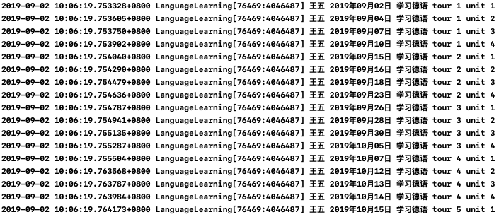

## MOSAD_HW2
### 介绍

个人作业2-面向对象与Objective-C语法学习

###  开发环境

* Mac OS
* Objective-C
* Xcode

DeadLine: 9月15日23:59 

### 第二周任务

### 面向对象与Objective-C语法学习

---

### 实验目的

1. 学习掌握Objective-C语法，掌握基础字符串操作。
2. OO知识——多态与继承

### 实验内容

给定三个用户张三，李四，王五。

给定四种语言英语、日语、德语、西班牙语。

实现场景输出（log形式即可）：随机选择一个用户和一种语言学习，从**当前日期**开始，随机产生时间进行学习，输出学习进度直至学习完毕。每个语言共8个tour，每个tour共4个unit，每次学习一个unit。

要求：

- 随机选定人名、语言后，一次性输出所有的结果。
- 随机时间指的是每次随机1-5天，每次学习时间在前一次的基础上加上刚刚随机出的天数。
- 需要用到多态。

输出例子： 张三 某年某月某日 学习日语 tour 1 unit 1。

### 验收内容

* 正确的输出格式
* 使用**多态**实现

### 提交要求及命名格式

/src 存放项目文件

/report 存放项目报告

个人项目提交方式:

- 布置的个人项目先fork到个人仓库下；
- clone自己仓库的个人项目到本地目录；
- 在个人项目中，在src、report目录下，新建个人目录，目录名为“学号+姓名”，例如“12345678WangXiaoMing”；
在“src\12345678WangXiaoMing”目录下，保存项目，按要求完成作业;
- 实验报告以md的格式，写在“report\12345678WangXiaoMing”目录下；
- 完成任务需求后，Pull Request回主项目的master分支，PR标题为“学号+姓名”， 如“12345678王小明”；
- 一定要在deadline前PR。因为批改后，PR将合并到主项目，所有同学都能看到合并的结果，所以此时是不允许再PR提交作业的。
