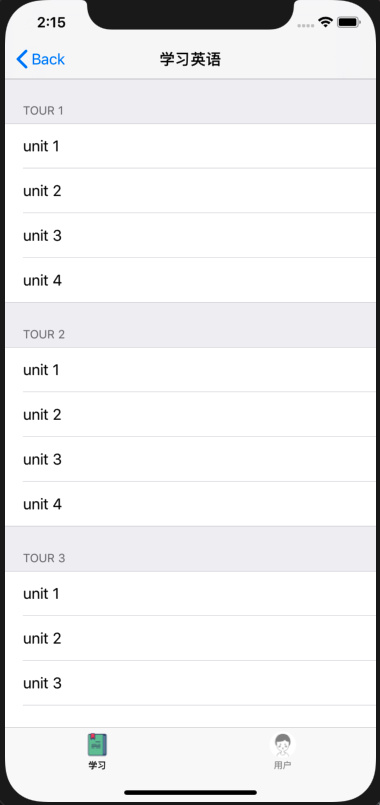
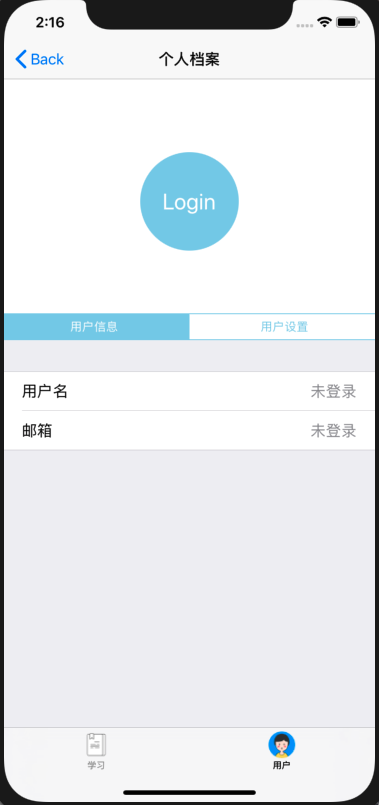
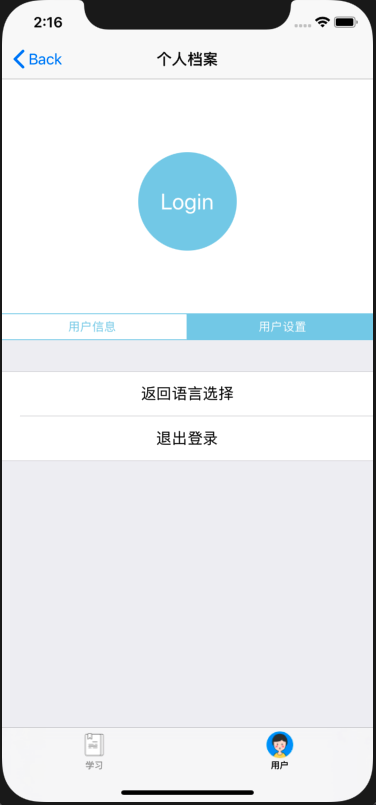
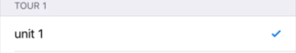
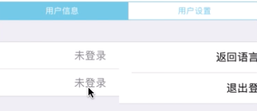

## MOSAD_HW3
### 介绍

个人作业3 - UI组件布局学习

###  开发环境

* Mac OS
* Objective-C
* Xcode

DeadLine: 10月7日23:59 

### 第四周任务

###  UI组件布局学习

---

### 实验目的

1. 学习使用纯代码进行UI布局

2. 学习UITableView, UICollectionView, UINavigationController, UITabBarController等组件的使用，以及delegate和protocol的概念

### 实验内容

实现一个包含若干页面和子页面的"多语言学习App"，页面如下：

|             初始页面             |           语言学习页面           |
| :------------------------------: | :------------------------------: |
|  |  |
|  个人档案页面（用户信息子页面）  |  个人档案页面（用户设置子页面）  |
|  |  |

manual中有演示视频，要求如下：

1. 初始页面是应用启动后显示的第一个页面，用于选择语种，内容包括：
   - 一个UILabel，要求文字水平居中
   - 一个UICollectionView，包含四个Cells：
     - 每个Cell包含一个UIImageView和一个UILabel，要求用自定义的UICollectionViewCell实现
     - 四个Cell排布成两行，UICollectionView整体需要水平居中
     - 点击任意一个Cell，跳转到语言学习页面
2. 从初始页面跳转后进入到由一个UITabBarController组成的页面，其包含两个子页面"学习XX语"和"个人档案"：
   - 底部的TarBar包含两个按钮"学习"和"用户"，分别对应两个子页面，点击按钮切换到对应的页面
   - 按钮在选中和未选中状态下图片和文字的颜色都不同，参考示例图
3. "语言学习页面"包含一个UITableView：
   - TableView共包含8个Sections（对应八个tours），每个Section包含四个Rows（对应四个units）
   - 每个Section的Header显示"TOUR X"，每个Cell显示"unit X"
   - 顶部导航栏的标题根据首页所选的语言，显示"学习XX语"
4. "个人档案"页面包含一个UIButton，一个UISegmentedControl以及两个子页面：
   - UIButton为圆形，直径110，文字为"Login"，背景色可以自定，要求水平居中
   - UISegmentedControl包含两个items，"用户信息"和"用户设置"，点击切换到相应的子页面，主题色需要与上面的UIButton相同
   - "用户信息"和"用户设置"子页面都包含一个UITableView，均只有一个Section和两个Cells：
     - "用户信息"的TableView包含"用户名"和"邮箱"两个Cells，右侧显示"未登录"
     - "用户设置"的TableView包含"返回语言选择"和"退出登录"两个Cells，要求文字居中，点击"返回语言选择"时，跳回到初始页面

5. 需要用到的图片素材已在`manual/resoures`给出

### 验收内容

- 实验内容中要求的各个组件是否正确齐全显示
- 实验内容中要求居中的部分是否居中
- 各个页面及子页面之间的正确跳转与切换
- 顶部导航栏的Title是否显示正确
- 底部TarBar的按钮图片正常显示

### 加分项

1. 给"学习XX语"页面的TableViewCell添加点击事件，点击某个Cell后，右侧出现打勾的图标(设置accessoryType)，再次点击则取消。要求：

   - TableView上下滚动时，各个Cell的打勾图标正确显示

   - 在"学习XX语"页面和"个人档案"页面之间切换时，各个Cell的打勾图标正确显示

     

2. 使用UIPageViewController来实现"个人档案"页面的两个子页面（"用户信息"和"用户设置"），要求：

   - 可以通过左右滑动来在切换这两个子页面

     

### 提交要求及命名格式

/src 存放项目文件

/report 存放项目报告

个人项目提交方式:

- 布置的个人项目先fork到个人仓库下；
- clone自己仓库的个人项目到本地目录；
- 在个人项目中，在src、report目录下，新建个人目录，目录名为“学号+姓名”，例如“12345678WangXiaoMing”；
在“src\12345678WangXiaoMing”目录下，保存项目，按要求完成作业;
- 实验报告以md的格式，写在“report\12345678WangXiaoMing”目录下；
- 完成任务需求后，Pull Request回主项目的master分支，PR标题为“学号+姓名”， 如“12345678王小明”；
- 一定要在deadline前PR。因为批改后，PR将合并到主项目，所有同学都能看到合并的结果，所以此时是不允许再PR提交作业的。
