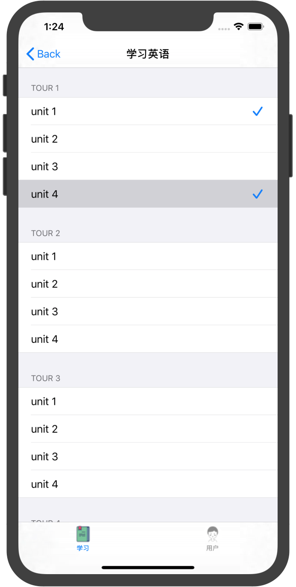

# 中山大学数据科学与计算机学院本科生实验报告
| 课程名称 | 现代操作系统应用开发 |   任课老师   |           郑贵锋            |
| :------: | :------------------: | :----------: | :-------------------------: |
|   年级   |        2016级        | 专业（方向） | 软件工程（计算机应用软件）  |
|   学号   |       16340129       |     姓名     |           梁俊华            |
|   电话   |     13902878689      |    Email     | liangjh45@mail2.sysu.edu.cn |
| 开始日期 |    2019年9月20日     |   完成日期   |        2019年9月30日        |

## 一、实验题目

### UI组件布局学习

- 学习使用纯代码进行UI布局

- 学习UITableView, UICollectionView, UINavigationController, UITabBarController等组件的使用，以及delegate和protocol的概念

## 二、实现内容

实现一个包含若干页面和子页面的"多语言学习App"，页面如下：

|                           初始页面                           |                         语言学习页面                         |
| :----------------------------------------------------------: | :----------------------------------------------------------: |
|  |  |
|                个人档案页面（用户信息子页面）                |                个人档案页面（用户设置子页面）                |
|  |  |

manual中有演示视频，要求如下：

1. 初始页面是应用启动后显示的第一个页面，用于选择语种，内容包括：
   - 一个UILabel，要求文字水平居中
   - 一个UICollectionView，包含四个Cells：
     - 每个Cell包含一个UIImageView和一个UILabel，要求用自定义的UICollectionViewCell实现
     - 四个Cell排布成两行，UICollectionView整体需要水平居中
     - 点击任意一个Cell，跳转到语言学习页面
2. 从初始页面跳转后进入到由一个UITabBarController组成的页面，其包含两个子页面"学习XX语"和"个人档案"：
   - 底部的TarBar包含两个按钮"学习"和"用户"，分别对应两个子页面，点击按钮切换到对应的页面
   - 按钮在选中和未选中状态下图片和文字的颜色都不同，参考示例图
3. "语言学习页面"包含一个UITableView：
   - TableView共包含8个Sections（对应八个tours），每个Section包含四个Rows（对应四个units）
   - 每个Section的Header显示"TOUR X"，每个Cell显示"unit X"
   - 顶部导航栏的标题根据首页所选的语言，显示"学习XX语"
4. "个人档案"页面包含一个UIButton，一个UISegmentedControl以及两个子页面：
   - UIButton为圆形，直径110，文字为"Login"，背景色可以自定，要求水平居中
   - UISegmentedControl包含两个items，"用户信息"和"用户设置"，点击切换到相应的子页面，主题色需要与上面的UIButton相同
   - "用户信息"和"用户设置"子页面都包含一个UITableView，均只有一个Section和两个Cells：
     - "用户信息"的TableView包含"用户名"和"邮箱"两个Cells，右侧显示"未登录"
     - "用户设置"的TableView包含"返回语言选择"和"退出登录"两个Cells，要求文字居中，点击"返回语言选择"时，跳回到初始页面

5. 需要用到的图片素材已在`manual/resoures`给出

## 三、实验结果

### (1)实验截图

参照上面要求给出的四个结果图如下所示：

|                           初始页面                           |                         语言学习页面                         |
| :----------------------------------------------------------: | :----------------------------------------------------------: |
|  |  |
|                个人档案页面（用户信息子页面）                |                个人档案页面（用户设置子页面）                |
|  |  |

### (2)实验步骤以及关键代码

#### 主页面

初始页面是应用启动后显示的第一个页面，用于选择语种，内容包括：

- 一个UILabel，要求文字水平居中，实现居中效果的代码如下所示：

  ``` objective-c
  // 设置UILabel.
  _label = [[UILabel alloc] initWithFrame:CGRectMake(0, 0, 200, 50)];
  // _label.backgroundColor = UIColor.blackColor;
  [_label setText:@"请选择语言"];                      // 设置UILabel的文字内容.
  [_label setFont:[UIFont systemFontOfSize:25]];     // 设置UILabel的文字大小.
  [_label setTextColor:[UIColor blackColor]];        // 设置UILabel的颜色.
  [_label setTextAlignment:NSTextAlignmentCenter];   // 设置UILabel的文字的对齐方式.
  [self.view addSubview:_label];
  
  // 居中设置
  // 设置首页文字的位置
  UIView * superview = self.view;
  [_label makeConstraints:^(MASConstraintMaker *make) {
      make.top.equalTo(superview.top).offset(200);
      make.centerX.equalTo(superview.centerX);
  }];
  
  _collections.center = superview.center;
  ```

- 一个UICollectionView，包含四个Cells：
  - 每个Cell包含一个UIImageView和一个UILabel，要求用自定义的UICollectionViewCell实现，自定义实现的UICollectionViewCell如下所示：
  
    ``` objective-c
    // MyCollectionViewCell.h
    
    @interface MyCollectionViewCell : UICollectionViewCell
    
    @property (strong, nonatomic) UIImageView * image;
    
    @property (strong, nonatomic) UILabel * label;
    
    - (void)setCellWithImage:(UIImage *)img withText:(NSString *)tex;
    
    @end
    ```
  
    ``` objective-c
    // MyCollectionViewCell.m
    
    - (void)setCellWithImage:(UIImage *)img
                    withText:(NSString *)tex {
        // 添加图片
        _image = [[UIImageView alloc] initWithImage:img];
        
        
        // 添加文字
        _label = [[UILabel alloc] initWithFrame:CGRectMake(0, 0, 70, 30)];
        _label.text = tex;
        _label.textAlignment = NSTextAlignmentCenter;
        _label.textColor = [UIColor blackColor];
        _label.font = [UIFont systemFontOfSize:18];
    
        [self.contentView addSubview:_image];
        [self.contentView addSubview:_label];
        
        [self setupLayout];
    }
    ```
  
  - 四个Cell排布成两行，UICollectionView整体需要水平居中，实现的代码如下所示：
  
    ``` objective-c
    // 设置Collection.
    UICollectionViewFlowLayout * layout = [[UICollectionViewFlowLayout alloc] init];
    layout.scrollDirection = UICollectionViewScrollDirectionVertical;
    layout.itemSize = CGSizeMake(150, 150);
    _collections = [[UICollectionView alloc] initWithFrame:CGRectMake(0, 0, 300, 300) collectionViewLayout:layout];
    [_collections registerClass:[MyCollectionViewCell class] forCellWithReuseIdentifier:COLLECTION_CELL_IDENTIFIER];
    _collections.backgroundColor = [UIColor whiteColor];
    _collections.delegate = self;
    _collections.dataSource = self;
    [self.view addSubview:_collections];
    ```
  
  - 点击任意一个Cell，跳转到语言学习页面，跳转的代码如下所示：
  
    ``` objective-c
    - (void)gotoTabBarListWith:(NSString *)language {
        MyTabBarController * tbc = [[MyTabBarController alloc] init];
        // self.hidesBottomBarWhenPushed = YES;
        tbc.name = language;
        [self.navigationController pushViewController:tbc animated:YES];
        // [self presentViewController:tbc animated:YES completion:nil];
        // NSArray * array = [self.navigationController viewControllers];
        // NSLog(@"%ld", [array count]);
    }
    ```

#### UITabBarController

从初始页面跳转后进入到由一个UITabBarController组成的页面，其包含两个子页面"学习XX语"和"个人档案"：

- 底部的TarBar包含两个按钮"学习"和"用户"，分别对应两个子页面，点击按钮切换到对应的页面

- 按钮在选中和未选中状态下图片和文字的颜色都不同，设计的代码如下所示：

  ``` objective-c
  - (void)setupChildrenController {
      
      _tbc = [[UITabBarController alloc] init];
      _tbc.delegate = self;
      _tbc.selectedIndex = 0;
      
      // 学习控制器
      LanguageListController * lc = [[LanguageListController alloc] init];
      lc.name = _name;
      lc.tabBarItem.title = @"学习";
      lc.tabBarItem.image = [UIImage imageNamed:@"learn1.png"];
      lc.tabBarItem.selectedImage = [UIImage imageNamed:@"learn2.png"];
      
      // 消息控制器
      ArchiveController * ac = [[ArchiveController alloc] initWithNav:self.navigationController];
      ac.tabBarItem.title = @"用户";
      ac.tabBarItem.image = [UIImage imageNamed:@"user1.png"];
      ac.tabBarItem.selectedImage = [UIImage imageNamed:@"user2.png"];
      
      // 添加自页面
      _tbc.viewControllers = @[lc, ac];
      [self.view addSubview:_tbc.view];
  }
  ```

#### UITableView

"语言学习页面"包含一个UITableView：

- TableView共包含8个Sections（对应八个tours），每个Section包含四个Rows（对应四个units），代码通过UITableView的代理来处理，如下：

  ``` objective-c
  #pragma mark UITableViewDataSource
  // Total sections = 8.
  - (NSInteger)numberOfSectionsInTableView:(UITableView *)tableView {
      return [_dataSource count];
  }
  
  // Rows for each section = 4.
  - (NSInteger)tableView:(UITableView *)tableView numberOfRowsInSection:(NSInteger)section {
      return [_dataSource[section][@"List"] count];
  }
  
  // Titles for each section.
  - (nullable NSString *)tableView:(UITableView *)tableView titleForHeaderInSection:(NSInteger)section {
      return _dataSource[section][@"Name"];
  }
  ```

- 每个Section的Header显示"TOUR X"，每个Cell显示"unit X"，通过数据代理来处理：

  ``` objective-c
  - (void)viewDidLoad {
      _dataSource = [@[
          @{@"Name" : @"TOUR 1",
            @"List" : @[@"unit 1", @"unit 2", @"unit 3", @"unit 4"]},
          @{@"Name" : @"TOUR 2",
            @"List" : @[@"unit 1", @"unit 2", @"unit 3", @"unit 4"]},
          @{@"Name" : @"TOUR 3",
            @"List" : @[@"unit 1", @"unit 2", @"unit 3", @"unit 4"]},
          @{@"Name" : @"TOUR 4",
            @"List" : @[@"unit 1", @"unit 2", @"unit 3", @"unit 4"]},
          @{@"Name" : @"TOUR 5",
            @"List" : @[@"unit 1", @"unit 2", @"unit 3", @"unit 4"]},
          @{@"Name" : @"TOUR 6",
            @"List" : @[@"unit 1", @"unit 2", @"unit 3", @"unit 4"]},
          @{@"Name" : @"TOUR 7",
            @"List" : @[@"unit 1", @"unit 2", @"unit 3", @"unit 4"]},
          @{@"Name" : @"TOUR 8",
            @"List" : @[@"unit 1", @"unit 2", @"unit 3", @"unit 4"]},
      ] mutableCopy];
      [super viewDidLoad];
      [self.view addSubview:self.tableView];
  }
  
  // 重写 dataSource 的 getter 方法.
  - (void)setDataSource:(NSArray<NSMutableDictionary *> *)dataSource {
      if (_dataSource != dataSource) {
          _dataSource = dataSource;
          [self.tableView reloadData];
      }
  }
  ```

- 顶部导航栏的标题根据首页所选的语言，显示"学习XX语"，在TabBar中判断传入的语言类型进行判断：

  ``` objective-c
  - (void)tabBarController:(UITabBarController *)tabBarController didSelectViewController:(UIViewController *)viewController {
      if (tabBarController.selectedIndex == 0) {
          [self setTitle:[@"学习" stringByAppendingString:_name]];
      } else {
          [self setTitle:@"个人档案"];
      }
  }
  ```

#### UISegementedController

"个人档案"页面包含一个UIButton，一个UISegmentedControl以及两个子页面：

- UIButton为圆形，直径110，文字为"Login"，背景色可以自定，要求水平居中，代码如下：

  ``` objective-c
  - (void)setupButton {
      _btn = [UIButton buttonWithType:UIButtonTypeRoundedRect];
      _btn.frame = CGRectMake(self.view.frame.size.width / 2 - RADIUS, 190, 110, 110);
      _btn.backgroundColor = [UIColor colorWithRed:134 / 255.0 green:206 / 255.0 blue:236 / 255.0 alpha:1];
      
      // 设置文本.
      [_btn setTitle:@"Login" forState:UIControlStateNormal];
      [_btn setTitleColor:[UIColor whiteColor] forState:UIControlStateNormal];
      
      // Bezier画圆.
      UIBezierPath * maskPath = [UIBezierPath bezierPathWithRoundedRect:_btn.bounds cornerRadius:_btn.frame.size.width / 2];
      CAShapeLayer * maskLayer = [[CAShapeLayer alloc] init];
      maskLayer.frame = _btn.bounds;
      maskLayer.path = maskPath.CGPath;
      _btn.layer.mask = maskLayer;
      
      [self.view addSubview:_btn];
  }
  ```

- UISegmentedControl包含两个items，"用户信息"和"用户设置"，点击切换到相应的子页面，主题色需要与上面的UIButton相同，通过添加绑定功能：

  ``` objective-c
  - (void)indexDidChangeForSegmentedControl:(UISegmentedControl *)sender {
      NSInteger selectIndex = sender.selectedSegmentIndex;
      NSLog(@"Enter selection!");
      switch(selectIndex) {
          case 0:
              NSLog(@"Select 0");
              _UserLeftTable.hidden = NO;
              _UserRightTable.hidden = YES;
              sender.selectedSegmentIndex = 0;
              [_UserLeftTable reloadData];
              tag = 0;
              break;
              
          case 1:
              NSLog(@"Select 1");
              _UserLeftTable.hidden = YES;
              _UserRightTable.hidden = NO;
              sender.selectedSegmentIndex = 1;
              [_UserRightTable reloadData];
              tag = 1;
              break;
              
          default:
              break;
      }
  }
  ```

  然后进行绑定：

  ``` objective-c
  [_sc addTarget:self action:@selector(indexDidChangeForSegmentedControl:) forControlEvents:UIControlEventValueChanged];
  ```

- "用户信息"和"用户设置"子页面都包含一个UITableView，均只有一个Section和两个Cells：

  - "用户信息"的TableView包含"用户名"和"邮箱"两个Cells，右侧显示"未登录"，代码如下所示：

    ``` objective-c
    - (UITableViewCell *)tableView:(UITableView *)tableView cellForRowAtIndexPath:(NSIndexPath *)indexPath {
        if (tag == 0) {
            // UITableViewCell * cell = [tableView dequeueReusableCellWithIdentifier:CELL_LEFT];
            UITableViewCell *  cell = [[UITableViewCell alloc] initWithStyle:UITableViewCellStyleValue1 reuseIdentifier:CELL_LEFT];
            
            cell.textLabel.text = _info[indexPath.row];
            cell.detailTextLabel.text = @"未登录";
            return cell;
        } else if (tag == 1) {
            // UITableViewCell * cell = [tableView dequeueReusableCellWithIdentifier:CELL_LEFT];
            UITableViewCell * cell = [[UITableViewCell alloc] initWithStyle:UITableViewCellStyleDefault reuseIdentifier:CELL_LEFT];
            
            cell.textLabel.text = _setting[indexPath.row];
            cell.textLabel.textAlignment = NSTextAlignmentCenter;
            return cell;
        }
        
        return nil;
    }
    ```

  - "用户设置"的TableView包含"返回语言选择"和"退出登录"两个Cells，要求文字居中，点击"返回语言选择"时，跳回到初始页面，代码如下所示：

    ``` objective-c
    - (void)gotoMain {
        NSLog(@"Return to root viewcontroller");
        NSArray * array = [_nav viewControllers];
        NSLog(@"%ld", [array count]);
        [_nav popToRootViewControllerAnimated:YES];
    }
    ```

#### 加分项☑️

给"学习XX语"页面的TableViewCell添加点击事件，点击某个Cell后，右侧出现打勾的图标(设置accessoryType)，再次点击则取消。要求：

- TableView上下滚动时，各个Cell的打勾图标正确显示
- 在"学习XX语"页面和"个人档案"页面之间切换时，各个Cell的打勾图标正确显示

代码如下：

``` objective-c
- (void)tableView:(UITableView *)tableView didSelectRowAtIndexPath:(NSIndexPath *)indexPath {
    // [tableView deselectRowAtIndexPath:indexPath animated:YES];
    if ([tableView cellForRowAtIndexPath:indexPath].accessoryType == UITableViewCellAccessoryCheckmark) {
        [tableView cellForRowAtIndexPath:indexPath].accessoryType = UITableViewCellAccessoryNone;
    } else {
        [tableView cellForRowAtIndexPath:indexPath].accessoryType = UITableViewCellAccessoryCheckmark;
    }
}
```

实验结果如下所示：



### (3)实验遇到的困难以及解决思路

#### 组件位置的布局

主要通过Masonry插件进行布局，但是在布局的时候往往会有些Bug，可以通过原始的方法来解决。

#### UITabBarController子组件无法popViewController的问题

这个问题困扰了我比较长的时间，我发现UITabBarController的NavigationController和子组件的NavigationController不是同一个，因此在查询子组件的NavigationController的UIViewController的数量时，发现值是0，显然是无法跳转回去的，我查询了众多资料都无法解决，最后通过传入UITabBarController的NavigationController来解决。

#### DetailTextLabel无法显示的问题

主要是因为dequeueReusableCellWithIdentifier会把cell锁死，而且因为这里用到的cell比较少，所以我就直接注释掉来解决。

## 四、实验思考及感想

本次实验是IOS开发用代码写界面的实验，总的来说在探索阶段还是比较艰苦的，很多看似很简单的东西，都花了很长的时间来写。因为工业界主要都是用代码来进行布局，因此熟悉掌握代码的写法还是非常关键的。但是布局的东西确实是比较繁琐。

