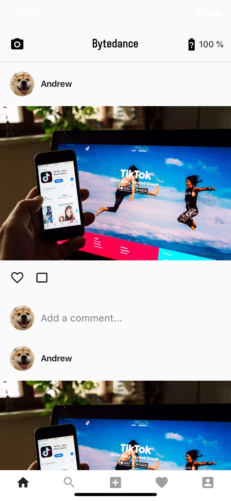

## MOSAD_HW4
### 介绍

个人作业4 - Flutter UI组件布局学习
###  开发环境

* Mac OS
* Dart && Objective-C
* Android Studio && Xcode

DeadLine: 10月27日23:59 

### 第五周任务

###  UI组件布局学习

### 实验目的

1. 学习使用Flutter进行UI布局

2. 学习StatelessWidget, ListView, Container, BottomAppBar, Row, Padding等组件的使用，以及MethodChannel和Navigation的概念

### 实验内容

参考官方教程搭建Flutter开发环境：https://flutterchina.club/setup-macos/

使用Flutter实现一个包含一个feed流页面的"社交App"，主页面如下：

 
 
manual中有演示视频，要求如下：

初始页面是应用启动后显示的第一个页面，可以上下滑动查看feed流。

 1. 初始页面顶部是一个AppBar。
 	- AppBar左边是一个摄像机Icon，要求距离左边12px边距，Icon图片使用Flutter自带的Icons.camera_alt，不需要加点击事件。
 	- AppBar右边是一个电量Icon组件和Text组件。距离右边12px边距，Icon图片使用Flutter自带的Icons.battery_unknown，点击事件在加分项里另说，如果不做加分项，AppBar右边这两个组件可以不用做。
 	- AppBar中间有一个Text，要求居中，文案为Helo.
2. 初始页面主体为一个ListView，ListView固定有六个Cell。每个Cell的样式都是相同的，要求必须复用。
 	- Cell上面有一个头像Image组件和昵称Text组件。头像图案使用manual文件夹里面的dog.jpeg。
 	- 所有边距都可以用16px或者10px来处理。
 	- Cell中间是一张图片，图片是manual文件夹里面的timg.jpeg。
 	- Cell图片下面是一个点赞按钮和评论按钮，点击事件不用做。点赞图案使用Flutter自带的Icons.favorite_border，评论图案使用Flutter自带的Icons.crop_3_2。
 	- Cell最下面是一个头像组件和一个文本框输入组件TextField。

3. 页面最下边是一个BottomAppBar组件，BottomAppBar里面用Row布局组件放五个Icon。分别是Icons.home，Icons.search，Icons.add_box，Icons.favorite，Icons.account_box。点击事件不用做。

### 验收内容

- 实验内容中要求的各个组件是否正确齐全显示
- 实验内容中要求居中的部分是否居中
- 顶部导航栏的组件是否显示正确
- 底部BottomAppBar的按钮图片是否正常显示

### 加分项
1. 点击Cell图片跳转到另一个页面。跳转使用Navigator.push来做。新的页面居中显示一个Image组件，顶部Appbar居中显示Andrew文案。字号默认大小，颜色为黑色。
 
 
2. 点击初始页面右上角的电池按钮，Flutter从Native获取电量，然后将剩余电量显示在电量按钮右边的文本组件上。这里要求使用Flutter与Native通信的MethodChannel组件。这里必须将主页面的父类从StatelessWidget改为StatefulWidget。不然无法调用setState更新显示的电量值。

### 提交要求及命名格式

/src 存放项目文件

/report 存放项目报告

个人项目提交方式:

- 布置的个人项目先fork到个人仓库下；
- clone自己仓库的个人项目到本地目录；
- 在个人项目中，在src、report目录下，新建个人目录，目录名为“学号+姓名”，例如“12345678WangXiaoMing”；
在“src\12345678WangXiaoMing”目录下，保存项目，按要求完成作业;
- 实验报告以md的格式，写在“report\12345678WangXiaoMing”目录下；
- 完成任务需求后，Pull Request回主项目的master分支，PR标题为“学号+姓名”， 如“12345678王小明”；
- 一定要在deadline前PR。因为批改后，PR将合并到主项目，所有同学都能看到合并的结果，所以此时是不允许再PR提交作业的。
