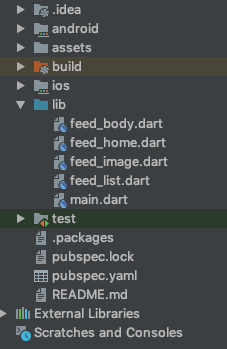

## UI组件的布局与使用

###  开发环境

* Mac OS
* Dart && Objective-C
* Android Studio && Xcode

参考文件结构：



Flutter开发环境搭建可以参考官方教程：
https://flutterchina.club/setup-macos/

### ListView

ListView.builder适合列表项比较多（或者无限）的情况，因为只有当子组件真正显示的时候才会被创建，也就说通过该构造函数创建的ListView是支持基于Sliver的懒加载模型的。下面看一个例子：


```dart
ListView.builder(
    itemCount: 100,
    itemExtent: 50.0, //强制高度为50.0
    itemBuilder: (BuildContext context, int index) {
      return ListTile(title: Text("$index"));
    }
);
```

### Image

加载本地图片:

1. 先要在pubspec.yaml的assets:下add要用到的图片
2. 使用AssetImage或者Image.asset组件根据路径加载本地图片


圆形头像:

	Container(
	        height: 40.0,
	        width: 40.0,
	        decoration: new BoxDecoration(
	          shape: BoxShape.circle,
	          image: new DecorationImage(
	              fit: BoxFit.fill,
	              image: new AssetImage(
	                  "assets/images/dog.jpeg")),
	        ),
	      )


### Navigator

在Flutter中，有两个主要的widget用于在页面之间导航：

- Route 是一个应用程序抽象的屏幕或页面；
- Navigator 是一个管理路由的widget；

Flutter中实现页面导航的有两种选择：

1. 具体指定一个由路由名构成的 Map。（MaterialApp）

		void main() {
		  runApp(MaterialApp(
		    home: MyAppHome(), // becomes the route named '/'
		    routes: <String, WidgetBuilder> {
		      '/a': (BuildContext context) => MyPage(title: 'page A'),
		      '/b': (BuildContext context) => MyPage(title: 'page B'),
		      '/c': (BuildContext context) => MyPage(title: 'page C'),
		    },
		  ));}

2. 直接跳转到一个路由。（WidgetApp）

		Navigator.push(context, MaterialPageRoute(builder: 
		(context) => FlutterDetailPage()));

	回退到上一级页面

 		Navigator.pop(context);


### MethadChannel

Flutter中提供了一个MethadChannel，用于Flutter和原生平台的通信。MethadChannel正是Flutter和原生之间通信的桥梁，它也是Flutter插件的底层基础设施。下面讲一个Native注册事件，Flutter调用的例子。

iOS Native:

	    FlutterMethodChannel* batteryChannel = [FlutterMethodChannel
	                                            methodChannelWithName:@"samples.flutter.dev/xxxx"
	                                            binaryMessenger:controller];
	    
	    __weak typeof(self) weakSelf = self;
	    [batteryChannel setMethodCallHandler:^(FlutterMethodCall* call, FlutterResult result) {
	        // Note: this method is invoked on the UI thread.
	        if ([@"xxx" isEqualToString:call.method]) {
	            result(@(100));
	        } else {
	            result(FlutterMethodNotImplemented);
	        }
	    }];

Flutter:

	  static const platform = const MethodChannel('samples.flutter.dev/xxxx');
	
	  Future<void> _invokeNative() async {
	    try {
	      final int result = await platform.invokeMethod('xxx');
	    } on PlatformException catch (e) {
	    }
		
	    setState(() {
	    //更新UI
	    });
	  }
