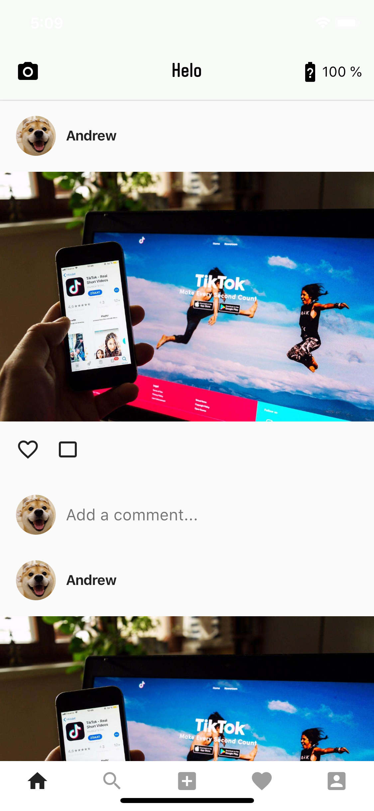
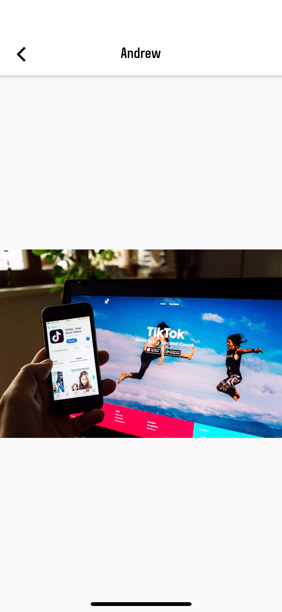
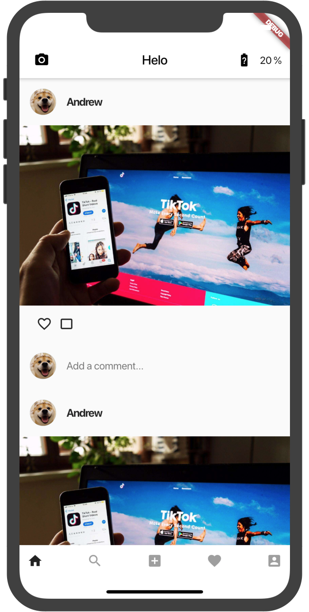
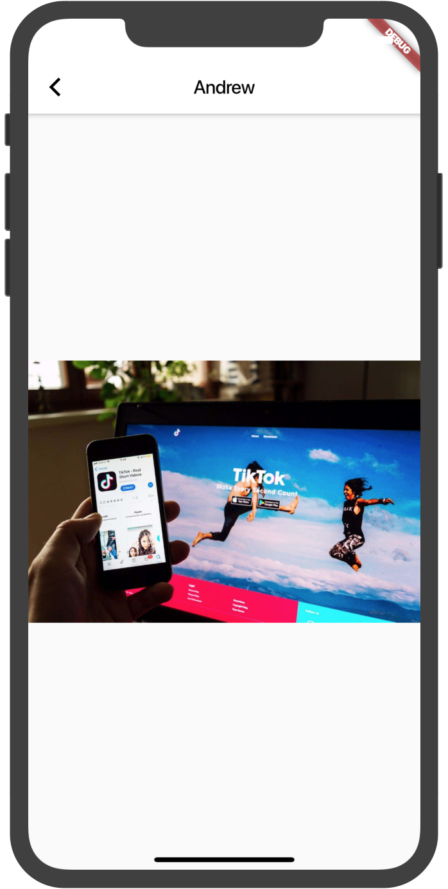

# 中山大学数据科学与计算机学院本科生实验报告
| 课程名称 | 现代操作系统应用开发 |   任课老师   |           郑贵锋            |
| :------: | :------------------: | :----------: | :-------------------------: |
|   年级   |        2016级        | 专业（方向） | 软件工程（计算机应用软件）  |
|   学号   |       16340129       |     姓名     |           梁俊华            |
|   电话   |     13902878689      |    Email     | liangjh45@mail2.sysu.edu.cn |
| 开始日期 |    2019年10月8日     |   完成日期   |       2019年10月20日        |


## 一、实验题目

个人作业4 - Flutter UI组件布局学习


## 二、实现内容

参考官方教程搭建Flutter开发环境：https://flutterchina.club/setup-macos/

使用Flutter实现一个包含一个feed流页面的"社交App"，主页面和加分项页面如下所示：

| 主页                                                         | 跳转页面                                                     |
| ------------------------------------------------------------ | ------------------------------------------------------------ |
|  |  |


## 三、实验结果

### (1)实验截图

| 主页                                                         | 跳转页面                                                     |
| ------------------------------------------------------------ | ------------------------------------------------------------ |
|  |  |

### (2)实验步骤以及关键代码

#### 1. 初始页面

  - AppBar左边是一个摄像机Icon，要求距离左边12px边距，Icon图片使用Flutter自带的Icons.camera_alt，不需要加点击事件。

    本部分实现的关键代码如下所示：

    ``` dart
    appBar: AppBar(
        title: Text(
            "Helo", // 标题
            style: textStyle,
        ),
        centerTitle: true,
        leading: IconButton(
            icon: Icon(Icons.camera_alt),
            padding: EdgeInsets.only(left: 12), // 间距为12px
            color: Colors.black,
            onPressed: () {},
        ),
        backgroundColor: Colors.white,
    ),
    ```

  - AppBar右边是一个电量Icon组件和Text组件。距离右边12px边距，Icon图片使用Flutter自带的Icons.battery_unknown，点击事件在加分项里另说，如果不做加分项，AppBar右边这两个组件可以不用做。

    组建放置的代码如下所示：

    ``` dart
    actions: <Widget>[
        new Row(
            children: <Widget>[
                // 电源图标的组件
                new Container(
                    padding: EdgeInsets.only(right: 0),
                    child: new IconButton(
                        icon: new Icon(Icons.battery_unknown),
                        color: Colors.black,
                        onPressed: _getBatteryLevel // 添加获取电源事件
                    ),
                ),
    
              	// 电源电量的数值
                new Container(
                    padding: EdgeInsets.only(right: 12),
                    child: new Text(
                        _batteryLevel,
                        textScaleFactor: 1.1,
                        style: textStyle,
                    ),
                )
            ],
        )
    ],
    ```

#### 2. ListView

初始页面主体为一个ListView，ListView固定有六个Cell。每个Cell的样式都是相同的，要求必须复用。

复用使用ListView.builder，且设置itemCount为6，代码如下所示：

``` dart
return ListView.builder(
    itemCount: 6,
    itemBuilder: (BuildContext context, int index) {
      // Do something ...
    }
```

  - Cell上面有一个头像Image组件和昵称Text组件。头像图案使用manual文件夹里面的dog.jpeg。

    关键代码如下所示：

    ``` dart
    return Container(
        child: Column(
            children: <Widget>[
                new Row(
                    children: <Widget>[
                      
                        // dog.jpeg图像
                        new Container(
                            padding: EdgeInsets.all(16),
                            child: new CircleAvatar(
                                backgroundImage: AssetImage("Resource/dog.jpeg"),
                            ),
                        ),
                      
                        // Andrew 图案
                        new Text(
                            "Andrew",
                            textScaleFactor: 1.2,
                            style: textStyle,
                        )
                    ],
                ),
            ],
        ),
    );
    ```

  - 所有边距都可以用16px或者10px来处理。

    ``` dart
    new Container(
        // 边距处理
        padding: EdgeInsets.all(16),
        child: new CircleAvatar(
            backgroundImage: AssetImage("Resource/dog.jpeg"),
        ),
    ),
    ```

  - Cell中间是一张图片，图片是manual文件夹里面的timg.jpeg。

    ``` dart
    new GestureDetector(
        // 点击添加跳转事件
        onTap: () {
            Navigator.push(context, MaterialPageRoute(builder: (_) {
                return ImagePage();
            }));
        },
      
        // 图片
        child: new Image.asset("Resource/timg.jpeg"),
    ),
    ```

  - Cell图片下面是一个点赞按钮和评论按钮，点击事件不用做。点赞图案使用Flutter自带的Icons.favorite_border，评论图案使用Flutter自带的Icons.crop_3_2。

    ```dart
    new Row(
        children: <Widget>[
            new Container(
                padding: EdgeInsets.all(16),
                child: new Row(
                    children: <Widget>[
                        // 使用favorite_border
                        new Container(
                            padding: EdgeInsets.only(left: 10),
                            child: new Icon(Icons.favorite_border),
                        ),
    										
                      	// 使用crop_3_2
                        new Container(
                            padding: EdgeInsets.only(left: 10),
                            child: new Icon(Icons.crop_3_2),
                        )
                    ],
                )
            ),
        ],
    ),
    ```

  - Cell最下面是一个头像组件和一个文本框输入组件TextField。

    ```dart
    new Row(
        children: <Widget>[
            // 头像组件
            new Container(
                padding: EdgeInsets.all(16),
                child: new CircleAvatar(
                    backgroundImage: AssetImage("Resource/dog.jpeg"),
                ),
            ),
    
    				// TextField组件
            new Expanded(
                child: new Container(
                    child: new TextField(
                        decoration: InputDecoration(
                            hintText: 'Add a comment...',
                            border: InputBorder.none
                        ),
                    ),
                )
            )
        ],
    ),
    ```

#### 3. BottomAppBar

页面最下边是一个BottomAppBar组件，BottomAppBar里面用Row布局组件放五个Icon。分别是Icons.home，Icons.search，Icons.add_box，Icons.favorite，Icons.account_box。点击事件不用做。

``` dart
bottomNavigationBar: new BottomAppBar(
    child: new Row(
        mainAxisAlignment: MainAxisAlignment.spaceBetween,
        mainAxisSize: MainAxisSize.max,

        children: <Widget>[
            new IconButton(icon: new Icon(Icons.home), onPressed: () {}),
            new IconButton(
              icon: new Icon(Icons.search, color: Colors.grey), 
              onPressed: () {}
            ),
            new IconButton(
              icon: new Icon(Icons.add_box, color: Colors.grey), 
              onPressed: () {}
            ),
            new IconButton(
              icon: new Icon(Icons.favorite, color: Colors.grey), 
              onPressed: () {}
            ),
            new IconButton(
              icon: new Icon(Icons.account_box, color: Colors.grey), 
              onPressed: () {}
            )
        ],
    ),
),
```

#### 4. 跳转

点击Cell图片跳转到另一个页面。跳转使用Navigator.push来做。新的页面居中显示一个Image组件，顶部Appbar居中显示Andrew文案。字号默认大小，颜色为黑色。

跳转的代码如下所示：

``` dart
new GestureDetector(
    // 点击添加跳转事件
    onTap: () {
        Navigator.push(context, MaterialPageRoute(builder: (_) {
            return ImagePage();
        }));
    },
  
    // 图片
    child: new Image.asset("Resource/timg.jpeg"),
),
```

跳转后页面的代码如下所示：

``` dart
class _ImagePageState extends State<ImagePage> {

    @override
    Widget build(BuildContext context) {
        const textStyle = const TextStyle(
            color: Colors.black,
        );
        // TODO: implement build
        return Scaffold(
            appBar: new AppBar(
                title: Text(
                    "Andrew",
                    style: textStyle,
                ),
                backgroundColor: Colors.white,
                iconTheme: IconThemeData(
                    color: Colors.black, //change your color here
                ),
            ),

          	// 居中
            body: Container(
                child: Center(
                    child: Image.asset("Resource/timg.jpeg"),
                ),
            ),

        );
    }
}
```

#### 5. 电池电量

点击初始页面右上角的电池按钮，Flutter从Native获取电量，然后将剩余电量显示在电量按钮右边的文本组件上。这里要求使用Flutter与Native通信的MethodChannel组件。这里必须将主页面的父类从StatelessWidget改为StatefulWidget。不然无法调用setState更新显示的电量值。

IOS端的代码：

``` objective-c
- (BOOL)application:(UIApplication *)application didFinishLaunchingWithOptions:(NSDictionary *)launchOptions {
  [GeneratedPluginRegistrant registerWithRegistry:self];
  // Override point for customization after application launch.

    FlutterViewController* controller = (FlutterViewController*)self.window.rootViewController;
    FlutterMethodChannel* batteryChannel = [FlutterMethodChannel methodChannelWithName:@"samples.flutter.io/battery" binaryMessenger:controller];

    [batteryChannel setMethodCallHandler:^(FlutterMethodCall * _Nonnull call, FlutterResult  _Nonnull result) {
        if ([@"getBatteryLevel" isEqualToString:call.method]) {
            int batteryLevel = [self getBatteryLabel];
            if (batteryLevel == -1) {
                result( [FlutterError errorWithCode:@"UNAVAILABLE" message:@"Battery info unavailable" details:nil]);
            } else {
                result (@(batteryLevel));
            }
        } else {
            result(FlutterMethodNotImplemented);
        }
    }];

    return [super application:application didFinishLaunchingWithOptions:launchOptions];
}

- (int) getBatteryLabel {
    UIDevice* device = [UIDevice currentDevice];
    device.batteryMonitoringEnabled = YES;
    if (device.batteryState == UIDeviceBatteryStateUnknown) {
        return -1;
    } else {
        return (int)(device.batteryLevel * 100);
    }
}
```

Flutter代码：

``` dart
class _MyHomePageState extends State<MyHomePage> {
    static const platform = const MethodChannel('samples.flutter.io/battery');
    String _batteryLevel = "100 %";
  
    Future<void> _getBatteryLevel() async {
        String batteryLevel;
        try {
            final int result = await platform.invokeMethod('getBatteryLevel');
            batteryLevel = '$result %';
            print(batteryLevel);
        } on PlatformException catch (e) {
            batteryLevel = "20 %";
            print(e);
        }

        setState(() {
            _batteryLevel = batteryLevel;
        });
    }

    @override
    Widget build(BuildContext context) {
        const textStyle = const TextStyle(
            color: Colors.black,
        );

        return Scaffold(
            appBar: AppBar(
                title: Text(
                    "Helo",
                    style: textStyle,
                ),
                centerTitle: true,
                leading: IconButton(
                    icon: Icon(Icons.camera_alt),
                    padding: EdgeInsets.only(left: 12),
                    // disabledColor: Colors.black,
                    color: Colors.black,
                    onPressed: () {},
                ),
                backgroundColor: Colors.white,
                actions: <Widget>[
                    new Row(
                        children: <Widget>[
                            new Container(
                                padding: EdgeInsets.only(right: 0),
                                child: new IconButton(
                                    icon: new Icon(Icons.battery_unknown),
                                    color: Colors.black,
                                    onPressed: _getBatteryLevel
                                ),
                            ),

                            new Container(
                                padding: EdgeInsets.only(right: 12),
                                child: new Text(
                                    _batteryLevel,
                                    textScaleFactor: 1.1,
                                    style: textStyle,
                                ),
                            )
                        ],
                    )
                ],
            ),
        );
    }
}
```


### (3)实验遇到的困难以及解决思路

1. Dart的语法比较生疏，因此在写代码的过程中往往需要试很多次才行，解决的办法就是到Flutter的官网上面看看相关的Demo，同时也在百度和谷歌上面进行搜索。

2. iPhone电量无法显示的问题，貌似这个现在解决不了，iPhone不支持在模拟器上面读取电量，只支持在真机上进行测试。

3. 跳转到新页面以后，设置为白色的背景色会掩盖原来的白色图标，解决的办法是设置如下代码：

   ``` dart
   iconTheme: IconThemeData(
       color: Colors.black, //change your color here
   ),
   ```

## 四、实验思考及感想

本次实验室Flutter的项目实践，实现的内容比较简单，但是由于对于Dart的代码不熟悉，以及对于Flutter的一些语法比较不熟悉，所以在上手的过程中还是遇到不少麻烦，但是通过查阅谷歌，很多问题其实很快就能得到解决，所以本次实验实际上还是比较简单的。
