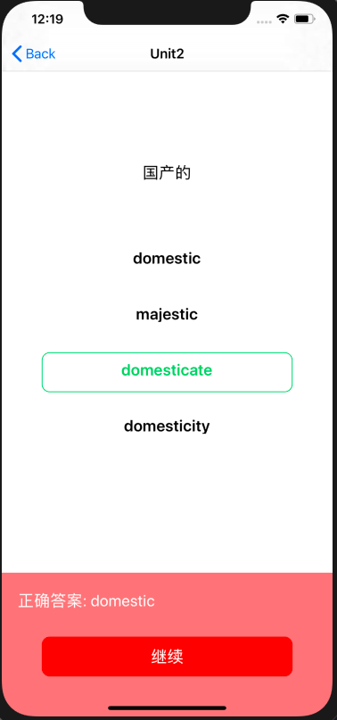
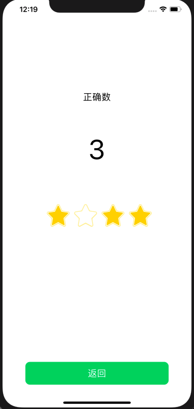

## MOSAD_HW5
### 介绍

个人作业5 - 网络访问与动画


###  开发环境

* Mac OS
* Objective-C
* Xcode

DeadLine: 11月10日23:59 


### 第九周任务

###  网络访问与动画

---

### 实验目的

1. 学习使用NSURLSession或AFNetworking库进行网络访问

2. 学习使用UIView动画及Core Animation动画


### 实验内容

实现一个简单的单词学习应用，页面如下：

|           初始页面           |          选择题页面          |
| :--------------------------: | :--------------------------: |
|  |  |
|           选择正确           |           选择错误           |
|  |  |
|           分数页面           |                              |
|  |                              |

manual中有演示视频，要求如下：

1. 初始页面是应用启动后显示的第一个页面，包含四个Unit选项（可以用CollectionView实现），要求：
   - 各选项水平居中，且内部的文字也水平居中
   - 每个选项的背景为圆角矩形，且背景色从左上角到右下角渐变（颜色可自选）
   
2. 点击任意Unit后，进入选择题界面。该页面每次显示一道题目，各选项垂直排列且水平居中。

   页面底部是一个UIButton，当没选中任何选项时，该按钮为灰色，不响应点击。

3. 当点击选中任意选项之后，该选项的文字变为绿色，且背景变为绿色的圆角矩形框，底部按钮的背景色也变为绿色。只能同时选中一个选项。

4. 点击底部"确认"按钮后，按钮文字变为"继续"，并且页面底部会弹出一个UIView，弹出动画的持续时间为0.5s。如果选项正确，则弹出的UIView背景色为绿色；若选项不正确，则背景色为红色，同时按钮的颜色也相应地变为红色（UIView的背景色与按钮的背景色需要有区别，建议用RGB值实现）。UIView的左上角显示正确答案。

5. 点击"继续"按钮后，底部UIView向下移动收回，动画持续时间0.5s。然后将页面上显示的题目替换为下一道。

6. 完成所有题目后，点击"继续"，进入分数界面，显示正确题数。

7. 题目信息的获取和选项的判断都需要通过访问网络API实现。该API中的题目共分四个Unit，每个Unit有四道题目，每个题目包含一个中文描述和四个英文单词选项。


需要用到的网络API：

**URL**：`https://service-p12xr1jd-1257177282.ap-beijing.apigateway.myqcloud.com/release/HW5_api`

#### 根据Unit获取题目：

Type：GET

Example parameters:

```
https://service-p12xr1jd-1257177282.ap-beijing.apigateway.myqcloud.com/release/HW5_api?unit=1
```

Example responses:

```json
{
	"data":[
    {
      "question": "国产的",
      "choices": ["domestic", "majestic", "domesticate", "domesticity"]
    },
    ......
  ]
}
```

#### 判断选项是否正确：

Type：POST

No parameters

Example request body:

```json
{
	"unit": "1",
	"question": "1",
	"answer": "domestic"
}
```

（请求体必须用Json格式）

Example responses:

选择正确：

```json
{
	"message": "right",
	"data": "domestic"
}
```

选择错误：

```json
{
	"message": "wrong",
	"data": "domestic"
}
```


### 验收内容

- 初始界面的选项使用渐变背景色
- 能够通过网络访问正常获取数据
- 底部控件弹出和收回的动画效果
- 分数界面能够显示正确数字


### 加分项

1. 在分数界面添加四个五角星⭐️图片，并在进入该界面时添加动画。

   - 进入该界面时，分数显示为"0"。各五角星均为空心。

   - 各五角星从左到右依次执行放大缩小的动画，每个五角星的动画持续时间为0.5s
- 每个五角星对应一道题目，当该题目选择正确时，五角星在动画执行完后变为实心，且分数加1
   - 参考manual中的演示视频


### 提交要求及命名格式

/src 存放项目文件

/report 存放项目报告

个人项目提交方式:

- 布置的个人项目先fork到个人仓库下；
- clone自己仓库的个人项目到本地目录；
- 在个人项目中，在src、report目录下，新建个人目录，目录名为“学号+姓名”，例如“12345678WangXiaoMing”；
在“src\12345678WangXiaoMing”目录下，保存项目，按要求完成作业;
- 实验报告以md的格式，写在“report\12345678WangXiaoMing”目录下；
- 完成任务需求后，Pull Request回主项目的master分支，PR标题为“学号+姓名”， 如“12345678王小明”；
- 一定要在deadline前PR。因为批改后，PR将合并到主项目，所有同学都能看到合并的结果，所以此时是不允许再PR提交作业的。
