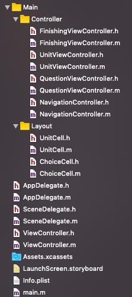

## 网络访问与动画

###  开发环境

* Mac OS
* Objective-C
* Xcode

参考文件结构：




### 基于NSURLSession的网络访问

Get请求

```objective-c
NSURLSessionConfiguration *defaultConfigObject = [NSURLSessionConfiguration defaultSessionConfiguration];
NSURLSession *delegateFreeSession = [NSURLSession sessionWithConfiguration: defaultConfigObject
                                                                  delegate: self
                                                             delegateQueue: [NSOperationQueue mainQueue]];

NSURL *url = [NSURL URLWithString:[NSString stringWithFormat: @"https://service-p12xr1jd-1257177282.ap-beijing.apigateway.myqcloud.com/release/HW5_api?unit=%lu", self.currentUnit]];
NSURLRequest *request = [NSURLRequest requestWithURL:url];

NSURLSessionDataTask * dataTask = [delegateFreeSession dataTaskWithRequest:request
                                                         completionHandler:^(NSData *data, NSURLResponse *response, NSError *error) {
				if(error == nil)
        {
            NSString * text = [[NSString alloc] initWithData: data encoding: NSUTF8StringEncoding];
            NSLog(@"Data = %@",text);
        }
}];
    
[dataTask resume];
```

Post请求：

```objective-c
NSURL * url = [NSURL URLWithString:@"https://service-p12xr1jd-1257177282.ap-beijing.apigateway.myqcloud.com/release/HW5_api"];
NSMutableURLRequest * urlRequest = [NSMutableURLRequest requestWithURL:url];
[urlRequest setHTTPMethod:@"POST"];

// 设置请求体为JSON
NSDictionary *dic = @{@"unit": @"0", @"question": @"0", @"Answer": @"America"};
NSError *error = nil;
NSData *jsonData = [NSJSONSerialization dataWithJSONObject:dic options:NSJSONWritingPrettyPrinted error:&error];
NSString *jsonString = [[NSString alloc] initWithData:jsonData encoding:NSUTF8StringEncoding];
[urlRequest setHTTPBody:[jsonString dataUsingEncoding:NSUTF8StringEncoding]];

NSURLSessionDataTask * dataTask =[delegateFreeSession dataTaskWithRequest:urlRequest
                                        completionHandler:^(NSData *data, NSURLResponse *response, NSError *error) {
				NSLog(@"Response:%@ %@\n", response, error);
        if(error == nil) {
        	NSString * text = [[NSString alloc] initWithData: data encoding: NSUTF8StringEncoding];
          NSDictionary *dict = [NSJSONSerialization JSONObjectWithData:data options:0 error:nil];
          NSLog(@"Data = %@",text);
        }
}];
[dataTask resume];
```


### 基于AFNetworking库的网络访问

AFNetWorking是对NSURLConnection和NSURLSession的封装，是较常用的HTTP网络框架。

```objective-c
// 创建Manager
self.manage = [AFHTTPSessionManager manager];
// 设置请求体为JSON
self.manage.requestSerializer = [AFJSONRequestSerializer serializer];
// 设置响应体为JSON
self.manage.responseSerializer = [AFJSONResponseSerializer serializer];
```

```objective-c
NSString *url = @".....";
NSDictionary *parameters = @{@"unit": @"0",
                             @"question": @"0",
                             @"answer": @"America"};
[self.manage POST:url parameters:parameters progress:^(NSProgress * _Nonnull uploadProgress) {

} success:^(NSURLSessionDataTask * _Nonnull task, id  _Nullable responseObject) {
    NSLog(@"请求成功：%@",responseObject);
} failure:^(NSURLSessionDataTask * _Nullable task, NSError * _Nonnull error) {
    NSLog(@"请求失败：%@", error);
}];
```

GET请求的使用方法与POST基本相同。


### 基于UIView Animation的动画

UIView Animation是一组用于实现 UIView 动画的类库，可以基于block来实现动画效果。常用参数为 `duration`持续时间，`delay`延迟时间，`UIViewAnimationOptions`枚举项和`completion`动画结束的回调。

```objective-c
[UIView animateWithDuration:0.5 delay:0.5 options:UIViewAnimationOptionBeginFromCurrentState animations:^ {
	self.myView.transform = CGAffineTransformTranslate(self.myView.transform, 0, 100);
} completion:^(BOOL finished) {
                
}];
```


### 基于UIView Animation的帧动画

基础动画只能将 UIView的属性从一个值变化到另一个值，而关键帧动画可以包含任意一个关键帧，使 UIView在多个值之间进行变化。关键帧动画可以看成是若干个连续执行的基础动画。

`addKeyframeWithRelativeStartTime:relativeDuration:animations:`方法用于添加关键帧，其中`relativeStartTime`参数相对起始时间，表示该关键帧开始执行的时刻在整个动画持续时间中的百分比。`relativeDuration`参数为相对持续时间，表示该关键帧占整个动画持续时间的百分比。两个参数均为浮点数类型，取值范围为0至1.

```objective-c
[UIView animateKeyframesWithDuration:0.5 delay:0.5 options:UIViewKeyframeAnimationOptionCalculationModeLinear animations:^{
            [UIView addKeyframeWithRelativeStartTime:0 relativeDuration:0.6 animations: ^{
                // key frame 0
            }];
            [UIView addKeyframeWithRelativeStartTime:0.6 relativeDuration:0.4 animations: ^{
                // key frame 1
            }];
        } completion:^(BOOL finished) {
            
        }];
```