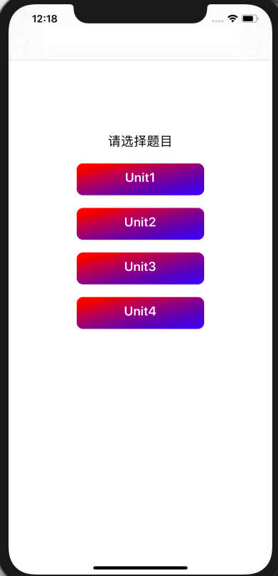
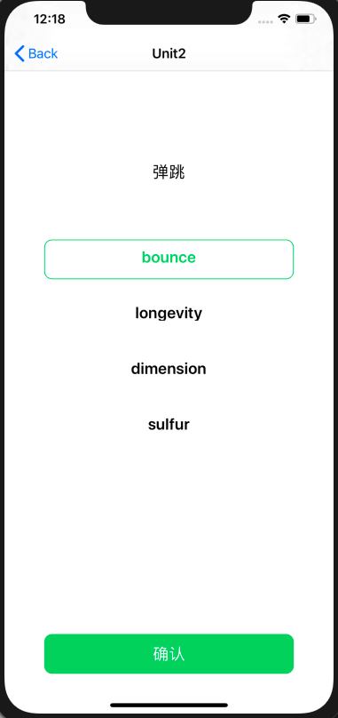
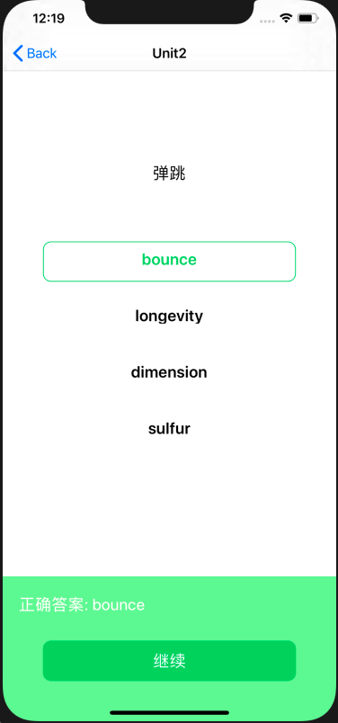
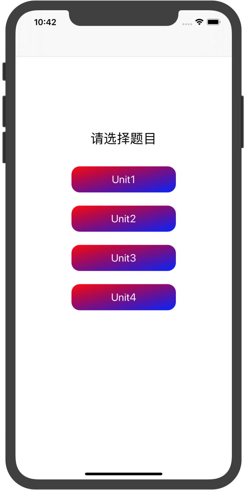
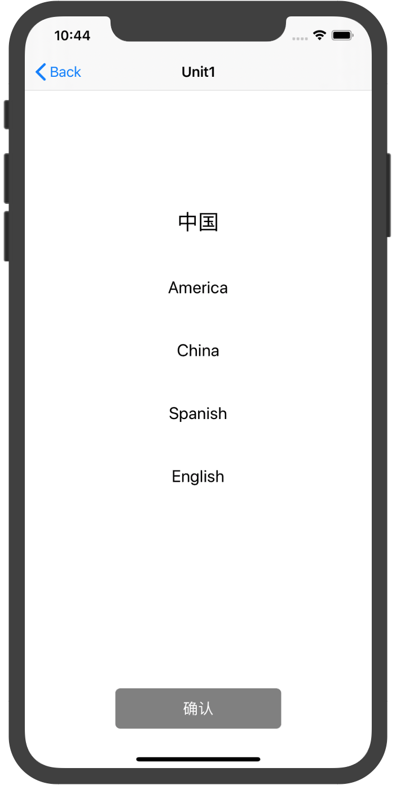
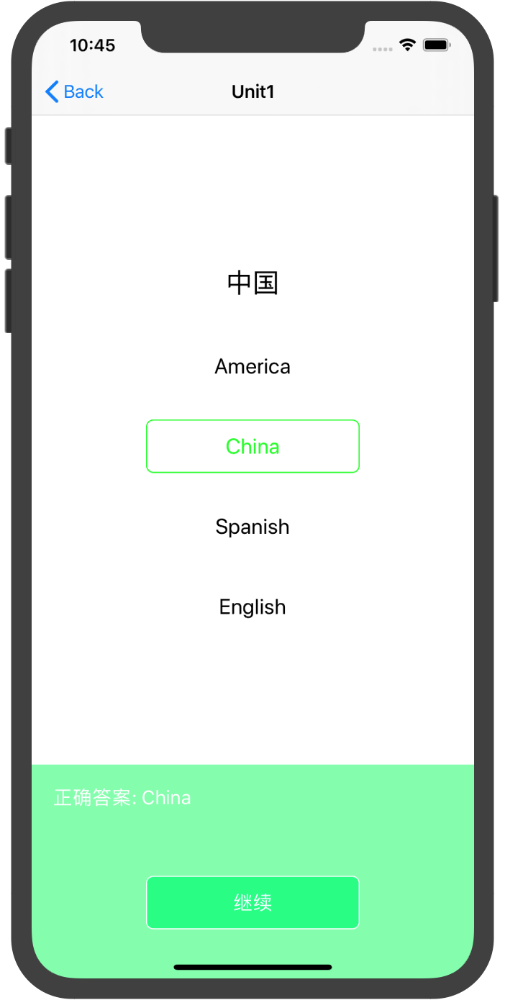
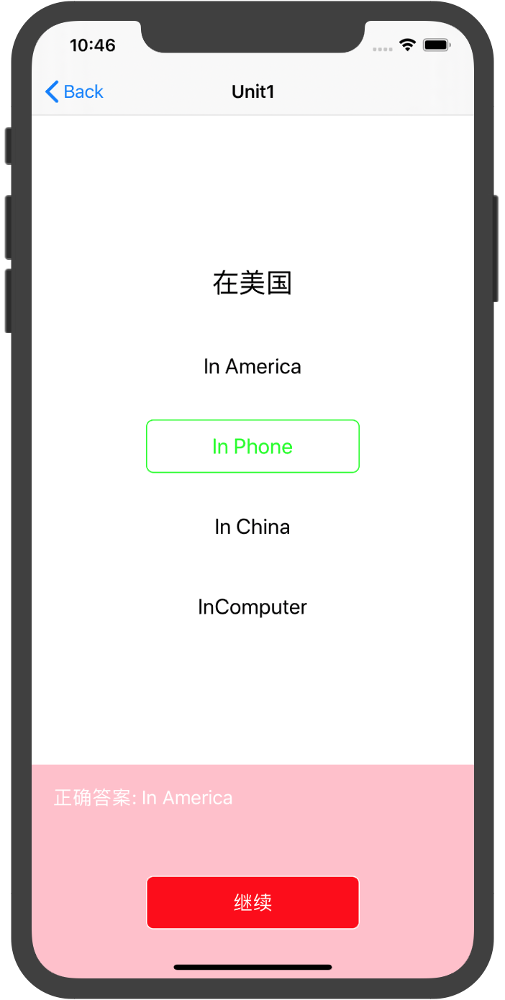
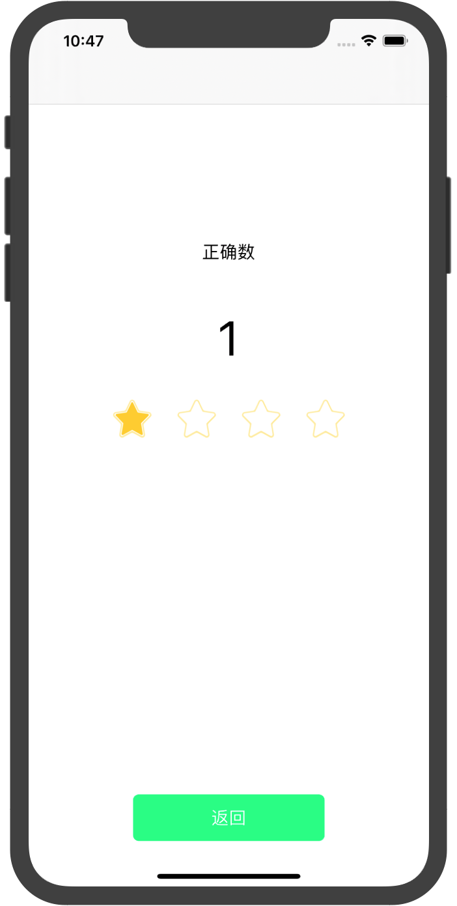

# 中山大学数据科学与计算机学院本科生实验报告
| 课程名称 | 现代操作系统应用开发 |   任课老师   |           郑贵锋            |
| :------: | :------------------: | :----------: | :-------------------------: |
|   年级   |        2016级        | 专业（方向） | 软件工程（计算机应用软件）  |
|   学号   |       16340129       |     姓名     |           梁俊华            |
|   电话   |     13902878689      |    Email     | liangjh45@mail2.sysu.edu.cn |
| 开始日期 |    2019年11月2日     |   完成日期   |        2019年11月3日        |


## 一、实验题目

个人作业5 - 网络访问与动画


## 二、实现内容

实现一个简单的单词学习应用，页面如下：

|       初始页面        |      选择题页面       |
| :-------------------: | :-------------------: |
|  |  |
|       选择正确        |       选择错误        |
|  |  |
|       分数页面        |                       |
|  |                       |

manual中有演示视频，要求如下：

1. 初始页面是应用启动后显示的第一个页面，包含四个Unit选项（可以用CollectionView实现），要求：

   - 各选项水平居中，且内部的文字也水平居中
   - 每个选项的背景为圆角矩形，且背景色从左上角到右下角渐变（颜色可自选）

2. 点击任意Unit后，进入选择题界面。该页面每次显示一道题目，各选项垂直排列且水平居中。

   页面底部是一个UIButton，当没选中任何选项时，该按钮为灰色，不响应点击。

3. 当点击选中任意选项之后，该选项的文字变为绿色，且背景变为绿色的圆角矩形框，底部按钮的背景色也变为绿色。只能同时选中一个选项。

4. 点击底部"确认"按钮后，按钮文字变为"继续"，并且页面底部会弹出一个UIView，弹出动画的持续时间为0.5s。如果选项正确，则弹出的UIView背景色为绿色；若选项不正确，则背景色为红色，同时按钮的颜色也相应地变为红色（UIView的背景色与按钮的背景色需要有区别，建议用RGB值实现）。UIView的左上角显示正确答案。

5. 点击"继续"按钮后，底部UIView向下移动收回，动画持续时间0.5s。然后将页面上显示的题目替换为下一道。

6. 完成所有题目后，点击"继续"，进入分数界面，显示正确题数。

7. 题目信息的获取和选项的判断都需要通过访问网络API实现。该API中的题目共分四个Unit，每个Unit有四道题目，每个题目包含一个中文描述和四个英文单词选项。


## 三、实验结果

### (1)实验截图

|                           初始页面                           |                          选择题页面                          |
| :----------------------------------------------------------: | :----------------------------------------------------------: |
|  |  |
|                           选择正确                           |                           选择错误                           |
|  |  |
|                           分数页面                           |                                                              |
|  |                                                              |

### (2)实验步骤以及关键代码

---

#### 步骤一

初始页面是应用启动后显示的第一个页面，包含四个Unit选项（可以用CollectionView实现），要求：

- 各选项水平居中，且内部的文字也水平居中
- 每个选项的背景为圆角矩形，且背景色从左上角到右下角渐变（颜色可自选）

首先是Unit选项的设置，使用的是自定义的Unit，水平居中使用Masonry，渐变色采用CAGradientLayer，具体实现在UnitCell.m的文件中，相关代码如下所示：

**样式及定位代码**：

``` objective-c
- (void)setUnitText:(NSString *)tex {
    _label = [[UILabel alloc] init];
    _label.text = tex;
    _label.textColor = UIColor.whiteColor;
    _label.font = [UIFont systemFontOfSize:20];
    
    [self.contentView addSubview:_label];
    [self setLayout];
}

- (void)setLayout {
    UIView * superview = self.contentView;
    
    [_label makeConstraints:^(MASConstraintMaker *make) {
        make.centerX.equalTo(superview.centerX);
        make.centerY.equalTo(superview.centerY);
    }];
    
    [self setGradientColor];
}
```

**渐变色的代码：**

``` objective-c
- (void)setGradientColor {
    CAGradientLayer * gradientLayer = [CAGradientLayer layer];
    gradientLayer.frame = self.bounds;
    
    gradientLayer.startPoint = CGPointMake(0, 0);
    gradientLayer.endPoint = CGPointMake(1, 1);
    
    gradientLayer.colors = @[(__bridge id)[UIColor redColor].CGColor, (__bridge id)[UIColor blueColor].CGColor];
    
    [self drawRect:self.frame];
    [self.contentView.layer insertSublayer:gradientLayer atIndex:0];
}

- (void)drawRect:(CGRect)rect {
    [super drawRect:rect];
    self.contentView.layer.cornerRadius = self.contentView.bounds.size.width * 0.08;
    self.contentView.layer.borderColor = [UIColor whiteColor].CGColor;
    self.contentView.layer.borderWidth = 0.1;
    self.contentView.layer.masksToBounds =  YES;
}
```

---

#### 步骤二

- 点击任意Unit后，进入选择题界面。该页面每次显示一道题目，各选项垂直排列且水平居中。

- 页面底部是一个UIButton，当没选中任何选项时，该按钮为灰色，不响应点击。

点击事件在UIViewCollection委托里面实现，选择界面也适用UIViewCollection来实现，底部的UIButton实现也是同理，具体的代码在ChoiceCell.m和QuestionViewController.m里面实现。

**实现Unit点击事件的代码**：

``` objective-c
// 设置点击事件
- (void)collectionView:(UICollectionView *)collectionView didSelectItemAtIndexPath:(NSIndexPath *)indexPath {
    NSString * unit = self.dataSource[indexPath.section];
    [self gotoUnit:unit];
}
```

**UIButton的布局如下所示：**

``` objective-c
    // Button
    _button = [[UIButton alloc] initWithFrame:CGRectMake(self.view.frame.size.width/2-100, 800, 200, 50)];
    // _buttonRect = CGRectMake(self.view.frame.size.width/2-100, 800, self.view.frame.size.width, 300);
    // _button.backgroundColor = [UIColor colorWithRed:0 / 255.0 green:255 / 255.0 blue:127 / 255.0 alpha:1];
    _button.enabled = NO;
    _button.layer.borderWidth = 1;
    _button.layer.cornerRadius = 7.0f;
    _button.layer.masksToBounds = YES;
    [_button setTitle:@"确认" forState:UIControlStateNormal];
    _button.layer.borderColor = UIColor.whiteColor.CGColor;
    _button.backgroundColor = [UIColor grayColor];
    [_button addTarget:self action:@selector(checkAnswer) forControlEvents:UIControlEventTouchUpInside];
```

---

#### 步骤三

- 当点击选中任意选项之后，该选项的文字变为绿色，且背景变为绿色的圆角矩形框，底部按钮的背景色也变为绿色。只能同时选中一个选项。

点击事件在UIViewCollection的委托里面实现，圆角矩形框使用普通的轮廓调整即可，同时选中一个选项只需要判断当前是否已选即可，具体的代码在QuestionViewController.m里面。

**Choice点击事件的代码如下所示：**

``` objective-c
// 设置点击事件
- (void)collectionView:(UICollectionViewCell *)collectionView didSelectItemAtIndexPath:(NSIndexPath *)indexPath {
    // Cancel the old print.
    NSLog(@"%@", choose);
    
    if (!isFinish) {
        if (![choose isEqual:NULL]) {
            ChoiceCell * cell = (ChoiceCell *)[_collection cellForItemAtIndexPath:choose];
            cell.layer.borderColor = UIColor.whiteColor.CGColor;
            [cell setTextColor:UIColor.blackColor];
        }

				// [_collection cellForItemAtIndexPath:choose].layer.borderColor = UIColor.whiteColor.CGColor;
        
        ChoiceCell * newCell = (ChoiceCell *)[_collection cellForItemAtIndexPath:indexPath];
        [_collection cellForItemAtIndexPath:indexPath].layer.borderColor = UIColor.greenColor.CGColor;
        [newCell setTextColor:UIColor.greenColor];
        _button.enabled = YES;
        [_button setBackgroundColor:[UIColor colorWithRed:0 / 255.0 green:255 / 255.0 blue:127 / 255.0 alpha:1]];
        curAnswer = newCell.word.text;
        
        choose = indexPath;
    }
}
```

---

#### 步骤四

- 点击底部"确认"按钮后，按钮文字变为"继续"，并且页面底部会弹出一个UIView，弹出动画的持续时间为0.5s。如果选项正确，则弹出的UIView背景色为绿色；若选项不正确，则背景色为红色，同时按钮的颜色也相应地变为红色（UIView的背景色与按钮的背景色需要有区别，建议用RGB值实现）。UIView的左上角显示正确答案。

弹框使用UIView Animation动画来实现，判断则通过网络访问进行，如果判断为正确，则变为绿色，否则变为红色，背景色采用RGB来调色，使得具有色差，具体代码在QuestionViewController.m里面。

**实现弹框的代码：**

``` objective-c
// 上拉
[_button setTitle:@"继续" forState:UIControlStateNormal];
[UIView animateWithDuration:0.5 delay:0.2 options:UIViewAnimationOptionBeginFromCurrentState animations:^{
    self->_animateView.transform = CGAffineTransformTranslate(self->_animateView.transform, 0, -200);
} completion:^(BOOL finished) {
    [self->_button removeTarget:self action:@selector(checkAnswer) forControlEvents:UIControlEventTouchUpInside];
    [self->_button addTarget:self action:@selector(viewGoBackToBottom) forControlEvents:UIControlEventTouchUpInside];
    self->_proc = self->_proc + 1;
    self->isFinish = YES;
    self->_button.enabled = YES;
}];
```

``` objective-c
// 下拉
- (void)viewGoBackToBottom {
    _button.enabled = NO;
    if (_proc != 4) {
        [UIView animateWithDuration:0.5 delay:0.2 options:UIViewAnimationOptionBeginFromCurrentState animations:^{
            self->_animateView.transform = CGAffineTransformTranslate(self->_animateView.transform, 0, 200);
        } completion:^(BOOL finished) {
            // 按钮在完成以后恢复到灰色
            self->_button.backgroundColor = [UIColor grayColor];
            [self->_button setTitle:@"确认" forState:UIControlStateNormal];
            [self->_button removeTarget:self action:@selector(viewGoBackToBottom) forControlEvents:UIControlEventTouchUpInside];
            [self->_button addTarget:self action:@selector(checkAnswer) forControlEvents:UIControlEventTouchUpInside];
            self->isFinish = NO;
            [self getUnitFromNetworkWithUnit:self->_num WithProcess:self->_proc];
            NSLog(@"Complete!");
        }];
        // _animateView.backgroundColor = [UIColor colorWithRed:127 / 255.0 green:255 / 255.0 blue:170 / 255.0 alpha:1];
    } else {
        [self gotoFinishView];
    }
}
```

**判断正误的代码：**

``` objective-c
- (void)checkAnswer {
    _button.enabled = NO;
    __block NSString * isOK = @"wrong";
    AFHTTPSessionManager * manager = [AFHTTPSessionManager manager];
    
    manager.requestSerializer = [AFJSONRequestSerializer serializer];
    manager.responseSerializer = [AFJSONResponseSerializer serializer];
    
    NSString * url = @"https://service-p12xr1jd-1257177282.ap-beijing.apigateway.myqcloud.com/release/HW5_api?unit=";
    NSString * URL = [url stringByAppendingString:_num];
    NSDictionary * dic = @{@"unit": _num,
                           @"question": [NSString stringWithFormat:@"%ld", self.proc],
                           @"Answer": curAnswer};
    NSLog(@"Request URL: %@", URL);
    NSLog(@"Post %@", dic);
    
    [manager POST:URL parameters:dic progress:^(NSProgress * _Nonnull uploadProgress) {
    } success:^(NSURLSessionDataTask * _Nonnull task, id  _Nullable responseObject) {
        NSLog(@"Request Successfully %@", responseObject);
        NSString * answer = [@"正确答案: " stringByAppendingFormat:@"%@", responseObject[@"data"]];
        self->_answer.text = answer;
        if ([responseObject[@"message"] isEqual:@"right"]) {
            isOK = @"right";
            [self->starCount replaceObjectAtIndex:self->_proc withObject:@"1"];
            self->_animateView.backgroundColor = [UIColor colorWithRed:127 / 255.0 green:255 / 255.0 blue:170 / 255.0 alpha:1];
        } else {
            // 红色
            self->_animateView.backgroundColor = [UIColor colorWithRed:255 / 255.0 green:192 / 255.0 blue:203 / 255.0 alpha:1];
            self->_button.backgroundColor = UIColor.redColor;
        }
    } failure:^(NSURLSessionDataTask * _Nullable task, NSError * _Nonnull error) {
        NSLog(@"Request Fail: %@", error);
    }];
    
    [_button setTitle:@"继续" forState:UIControlStateNormal];
    [UIView animateWithDuration:0.5 delay:0.2 options:UIViewAnimationOptionBeginFromCurrentState animations:^{
        self->_animateView.transform = CGAffineTransformTranslate(self->_animateView.transform, 0, -200);
    } completion:^(BOOL finished) {
        [self->_button removeTarget:self action:@selector(checkAnswer) forControlEvents:UIControlEventTouchUpInside];
        [self->_button addTarget:self action:@selector(viewGoBackToBottom) forControlEvents:UIControlEventTouchUpInside];
        self->_proc = self->_proc + 1;
        self->isFinish = YES;
        self->_button.enabled = YES;
    }];
}
```

****

#### 步骤五

- 点击"继续"按钮后，底部UIView向下移动收回，动画持续时间0.5s。然后将页面上显示的题目替换为下一道。

下拉过程在上面已经给出，相关的代码如下所示：

``` objective-c
// 下拉
- (void)viewGoBackToBottom {
    _button.enabled = NO;
    if (_proc != 4) {
        [UIView animateWithDuration:0.5 delay:0.2 options:UIViewAnimationOptionBeginFromCurrentState animations:^{
            self->_animateView.transform = CGAffineTransformTranslate(self->_animateView.transform, 0, 200);
        } completion:^(BOOL finished) {
            // 按钮在完成以后恢复到灰色
            self->_button.backgroundColor = [UIColor grayColor];
            [self->_button setTitle:@"确认" forState:UIControlStateNormal];
            [self->_button removeTarget:self action:@selector(viewGoBackToBottom) forControlEvents:UIControlEventTouchUpInside];
            [self->_button addTarget:self action:@selector(checkAnswer) forControlEvents:UIControlEventTouchUpInside];
            self->isFinish = NO;
            [self getUnitFromNetworkWithUnit:self->_num WithProcess:self->_proc];
            NSLog(@"Complete!");
        }];
        // _animateView.backgroundColor = [UIColor colorWithRed:127 / 255.0 green:255 / 255.0 blue:170 / 255.0 alpha:1];
    } else {
        [self gotoFinishView];
    }
}
```

---

#### 步骤六

- 完成所有题目后，点击"继续"，进入分数界面，显示正确题数。

分数界面也是用UICollectionView来实现，具体的代码在FinishingViewController.m中。

**显示分数的界面如下所示：**

``` objective-c
- (void)setup {
    // Title
    _title = [[UILabel alloc] initWithFrame:CGRectMake(0, 0, 500, 50)];
    _title.text = @"正确数";
    _title.font = [UIFont systemFontOfSize:18];
    [self.view addSubview:_title];
    
    // Count
    _count = [[UILabel alloc] initWithFrame:CGRectMake(0, 0, 500, 100)];
    _count.text = @"0";//[NSString stringWithFormat:@"%ld", starCount];
    _count.font = [UIFont systemFontOfSize:50];
    [self.view addSubview:_count];
    
    
    // Button
    _button = [[UIButton alloc] initWithFrame:CGRectMake(self.view.frame.size.width/2-100, 800, 200, 50)];
    _button.layer.borderWidth = 1;
    _button.layer.cornerRadius = 7.0f;
    _button.layer.masksToBounds = YES;
    [_button setTitle:@"返回" forState:UIControlStateNormal];
    _button.layer.borderColor = UIColor.whiteColor.CGColor;
    _button.backgroundColor = [UIColor colorWithRed:0 / 255.0 green:255 / 255.0 blue:127 / 255.0 alpha:1];
    [_button addTarget:self action:@selector(goBackToRoot) forControlEvents:UIControlEventTouchUpInside];
    [self.view addSubview:_button];
    
    // 设置Collection.
    UICollectionViewFlowLayout * layout = [[UICollectionViewFlowLayout alloc] init];
    layout.scrollDirection = UICollectionViewScrollDirectionVertical;
    layout.itemSize = CGSizeMake(50, 50);
    _collection = [[UICollectionView alloc] initWithFrame:CGRectMake(0, 0, 300, 120) collectionViewLayout:layout];
    [_collection registerClass:[StarUnit class] forCellWithReuseIdentifier:COLLECTION_CELL_IDENTIFIER];
    _collection.backgroundColor = UIColor.whiteColor;
    _collection.dataSource = self;
    _collection.delegate = self;
    [self.view addSubview:_collection];
    
    [self setLayout];
}

- (void)setLayout {
    UIView * superview = self.view;
    
    // Title
    [_title makeConstraints:^(MASConstraintMaker *make) {
        make.top.equalTo(superview.top).offset(230);
        make.centerX.equalTo(superview.centerX);
    }];
    
    // Count
    [_count makeConstraints:^(MASConstraintMaker *make) {
        make.top.equalTo(superview.top).offset(300);
        make.centerX.equalTo(superview.centerX);
    }];
    
    // Collection
    _collection.center = superview.center;
}

- (void)goBackToRoot {
    [self.navigationController popToRootViewControllerAnimated:NO];
}

```

---

#### 步骤七

- 题目信息的获取和选项的判断都需要通过访问网络API实现。该API中的题目共分四个Unit，每个Unit有四道题目，每个题目包含一个中文描述和四个英文单词选项。

网络访问使用的是AFNetworking，但是有相应的延时，所以有时候可能有点bug，具体实现的代码在QuestionViewController.m中。

**网络访问的代码如下所示：**

``` objective-c
- (void)getUnitFromNetworkWithUnit:(NSString *)Unit
                       WithProcess:(NSInteger)procs {
    AFHTTPSessionManager * manager = [AFHTTPSessionManager manager];
    
    manager.requestSerializer = [AFJSONRequestSerializer serializer];
    manager.responseSerializer = [AFJSONResponseSerializer serializer];
    
    NSString * url = @"https://service-p12xr1jd-1257177282.ap-beijing.apigateway.myqcloud.com/release/HW5_api?unit=";
    NSString * URL = [url stringByAppendingString:Unit];
    NSLog(@"Request URL: %@", URL);
    
    [manager GET:URL parameters:nil progress:^(NSProgress * _Nonnull downloadProgress) {
    } success:^(NSURLSessionDataTask * _Nonnull task, id  _Nullable responseObject) {
        NSLog(@"Request Successfully");
        [self.dataSource replaceObjectAtIndex:0 withObject:responseObject[@"data"][procs][@"choices"][0]];
        [self.dataSource replaceObjectAtIndex:1 withObject:responseObject[@"data"][procs][@"choices"][1]];
        [self.dataSource replaceObjectAtIndex:2 withObject:responseObject[@"data"][procs][@"choices"][2]];
        [self.dataSource replaceObjectAtIndex:3 withObject:responseObject[@"data"][procs][@"choices"][3]];
        self->_label.text = responseObject[@"data"][procs][@"question"];
        [self->_collection reloadData];
        NSLog(@"%@", responseObject[@"data"][procs][@"choices"][0]);
    } failure:^(NSURLSessionDataTask * _Nullable task, NSError * _Nonnull error) {
        NSLog(@"Request Fail: %@", error);
    }];
}
```

---

#### 加分项

在分数界面添加四个五角星⭐️图片，并在进入该界面时添加动画。

- 进入该界面时，分数显示为"0"。各五角星均为空心。
- 各五角星从左到右依次执行放大缩小的动画，每个五角星的动画持续时间为0.5s

- 每个五角星对应一道题目，当该题目选择正确时，五角星在动画执行完后变为实心，且分数加1

相关的代码如下所示：

``` objective-c
// 设置cell
- (UICollectionViewCell *)collectionView:(UICollectionView *)collectionView
                  cellForItemAtIndexPath:(nonnull NSIndexPath *)indexPath {
    StarUnit * cell = (StarUnit *)[collectionView dequeueReusableCellWithReuseIdentifier:COLLECTION_CELL_IDENTIFIER forIndexPath:indexPath];
    
    [UIView animateKeyframesWithDuration:0.5 delay:0.5 * indexPath.item options:UIViewKeyframeAnimationOptionCalculationModeLinear animations:^{
        [UIView addKeyframeWithRelativeStartTime:0 relativeDuration:0.6 animations: ^{
            cell.contentView.transform = CGAffineTransformScale(cell.contentView.transform, 1.5, 1.5);
        }];
        [UIView addKeyframeWithRelativeStartTime:0.6 relativeDuration:0.4 animations: ^{
            cell.contentView.transform = CGAffineTransformScale(cell.contentView.transform, 0.66, 0.66);
        }];
    } completion:^(BOOL finished) {
        if ([self->_stars[indexPath.item] isEqualToString:@"1"]) {
            cell.image.image = [UIImage imageNamed:@"Star1.png"];
            [cell setLayout];
            self->starCount += 1;
            self->_count.text = [NSString stringWithFormat:@"%ld", self->starCount];
        }
    }];
    
    return cell;
}
```

### (3)实验遇到的困难以及解决思路

1. 网络访问的JSON格式的解析：这部花了很多时间，主要是不清楚JSON格式的访问方式，所以花了很多无谓的时间来查询，最后发现可以直接进行访问。
2. 加分项动画：一开始我是使用关键帧，每一帧进行调整，发现最后都无法时间，正确的做法应该是在completion里面进行相关的实现。
3. 网络访问的速度较慢：我觉得可以用缓存来解决下这个问题，但是又好像跟题目相悖，所以最后就通过delay来减少相关的影响。

## 四、实验思考及感想

本次实验是动画和网络的综合运用，也较多地使用了以前学到的知识，难度还是比较大的，思考和查阅的时间也非常多，所以这次实验还是很锻炼自己的查阅能力和代码能力。

