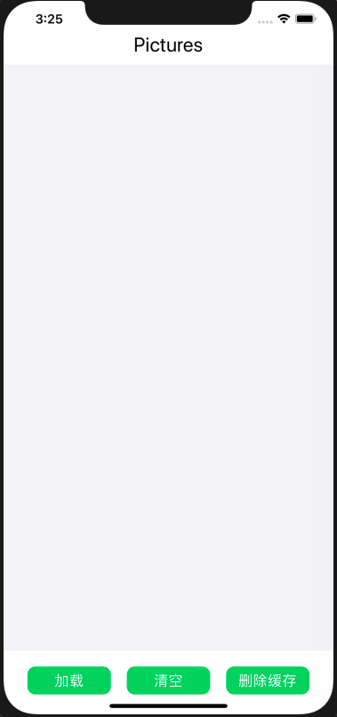
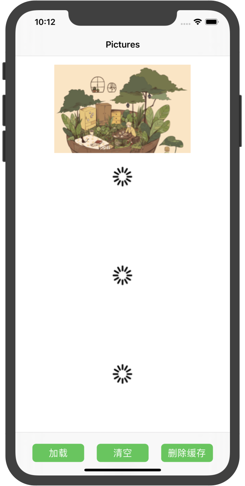
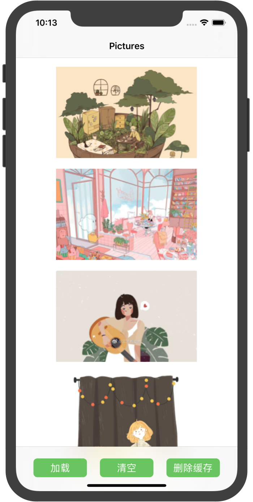
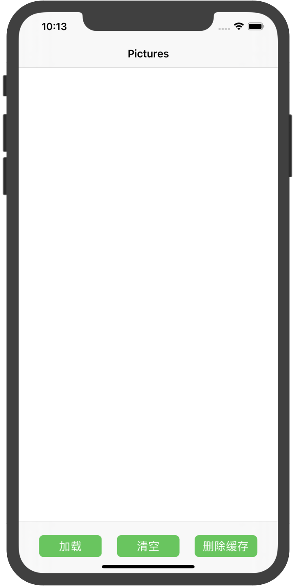

# 中山大学数据科学与计算机学院本科生实验报告
| 课程名称 | 现代操作系统应用开发 |   任课老师   |           郑贵锋            |
| :------: | :------------------: | :----------: | :-------------------------: |
|   年级   |        2016级        | 专业（方向） | 软件工程（计算机应用软件）  |
|   学号   |       16340129       |     姓名     |           梁俊华            |
|   电话   |     13902878689      |    Email     | liangjh45@mail2.sysu.edu.cn |
| 开始日期 |    2019年11月23日    |   完成日期   |       2019年11月24日        |


## 一、实验题目

个人作业6 - 多线程和本地存储


## 二、实现内容

1. 学习使用NSOperation或GCD进行多线程操作

2. 学习iOS沙盒机制，进行文件读写操作


### 实验内容

实现一个简单的图片浏览应用，页面如下：

|         初始状态         |         加载图片         |
| :----------------------: | :----------------------: |
|  |  |

manual中有演示视频，要求如下：

1. 只有一个页面，包含一个Label，一个图片列表（可以用UICollectionView或UITableView），以及三个按钮（"加载" "清空" "删除缓存"）。
2. 点击"加载"按钮，若Cache中没有缓存的文件，则加载网络图片并显示在图片列表中，要求：
   - 在子线程下载图片，返回主线程更新UI
   - 图片下载完成前，显示loading图标
   - 图片下载后，存入沙盒的Cache中
3. 点击"加载"按钮，若Cache中已存在图片文件，则直接从Cache中读取出图片并显示。
4. 点击"清空"按钮，清空图片列表中的所有图片。
5. 点击"删除缓存"按钮，删除存储在Cache中的图片文件。


## 三、实验结果

### (1)实验截图

实验的不同步骤的结果图如下所示：

|         初始状态         |         加载过程         |
| :----------------------: | :----------------------: |
|  |  |
|         加载完毕         |         清空         |
|  |  |


### (2)实验步骤以及关键代码

#### 1. 实现页面的基础内容，如三个按钮（加载、清空、删除缓存）和图片的显示

这部分的内容都是前面学习过的知识，如页面布局和按钮的使用等等，实现按钮就是用UIButton，图片的表示使用UIImageView，底部为UITabBarController，顶部为NavigationController，具体实现的代码如下：

- 按钮和TabBar的布局

``` objective-c
// TabBar的初始化
_tbc = [[UITabBarController alloc] init];
_tbc.delegate = self;
_tbc.selectedIndex = 0;


// 加载按钮的设定
UIButton * _btn1 = [[UIButton alloc] initWithFrame:CGRectMake(self.view.frame.size.width * 0.2 - 50, 835, 100, 35)];
_btn1.backgroundColor = [UIColor colorWithRed:102 / 255.0 green:199 / 255.0 blue:90 / 255.0 alpha:1];
_btn1.layer.borderWidth = 1;
_btn1.layer.cornerRadius = 7.0f;
_btn1.layer.masksToBounds = YES;
_btn1.layer.borderColor = (__bridge CGColorRef _Nullable)(UIColor.whiteColor);
[_btn1 setTitle:@"加载" forState:UIControlStateNormal];
[_btn1 addTarget:self action:@selector(download) forControlEvents:UIControlEventTouchUpInside];

// 清空按钮的设定
UIButton * _btn2 = [[UIButton alloc] initWithFrame:CGRectMake(self.view.frame.size.width / 2 - 50, 835, 100, 35)];
_btn2.backgroundColor = [UIColor colorWithRed:102 / 255.0 green:199 / 255.0 blue:90 / 255.0 alpha:1];
_btn2.layer.borderWidth = 1;
_btn2.layer.cornerRadius = 7.0f;
_btn2.layer.masksToBounds = YES;
_btn2.layer.borderColor = (__bridge CGColorRef _Nullable)(UIColor.whiteColor);
[_btn2 setTitle:@"清空" forState:UIControlStateNormal];
[_btn2 addTarget:self action:@selector(clean) forControlEvents:UIControlEventTouchUpInside];

// 删除缓存按钮的设定
UIButton * _btn3 = [[UIButton alloc] initWithFrame:CGRectMake(self.view.frame.size.width * 0.8 - 50, 835, 100, 35)];
_btn3.backgroundColor = [UIColor colorWithRed:102 / 255.0 green:199 / 255.0 blue:90 / 255.0 alpha:1];
_btn3.layer.borderWidth = 1;
_btn3.layer.cornerRadius = 7.0f;
_btn3.layer.masksToBounds = YES;
_btn3.layer.borderColor = (__bridge CGColorRef _Nullable)(UIColor.whiteColor);
[_btn3 setTitle:@"删除缓存" forState:UIControlStateNormal];
[_btn3 addTarget:self action:@selector(deleteCache) forControlEvents:UIControlEventTouchUpInside];

// 添加到页面
[_tbc.view addSubview:_btn1];
[_tbc.view addSubview:_btn2];
[_tbc.view addSubview:_btn3];
 _tbc.viewControllers = @[imgcv];
[self.view addSubview:_tbc.view];
```

- UICollectionController的显示：

``` objective-c
- (void)setup {
    // Collection
    UICollectionViewFlowLayout * layout = [[UICollectionViewFlowLayout alloc] init];
    layout.scrollDirection = UICollectionViewScrollDirectionVertical;//UICollectionViewScrollDirectionVertical;
    layout.itemSize = CGSizeMake(self.view.frame.size.width - 10, 170);
    _collect = [[UICollectionView alloc] initWithFrame:CGRectMake(0, 95, self.view.frame.size.width, 2000) collectionViewLayout:layout];
    [_collect registerClass:[ImageCell class] forCellWithReuseIdentifier:COLLECTION_CELL_IDENTIFIER];
    _collect.backgroundColor = UIColor.whiteColor;
    // _collect.alwaysBounceVertical = YES;
    _collect.dataSource = self;
    _collect.delegate = self;
    _collect.alwaysBounceVertical = YES;
    [self.view addSubview:_collect];
}
```

#### 2. 点击"加载"按钮，若Cache中没有缓存的文件，则加载网络图片并显示在图片列表中

实现要求如下：

- 在子线程下载图片，返回主线程更新UI
- 图片下载完成前，显示loading图标
- 图片下载后，存入沙盒的Cache中

该部分使用GCD来实现，GCD多线程操作基于任务和队列的概念，使用步骤为创建一个队列和将任务追加到队列中，具体的代码解释如下所示：

``` objective-c
// 此方法用于下载图片或者从沙盒中获取图片
- (void)downloadImage {
    // 临时变量，主要用于获取网络图片或者沙盒中的内容
    NSMutableArray<NSData *> * imageSet = [NSMutableArray arrayWithCapacity:6];
    
    // 首先判断沙盒是否为空，若沙盒不为空，则从沙盒中获取图片
    if ([self isCacheExist]) {
        NSLog(@"Cache is not empty!");
        NSString * cacheDir = [NSSearchPathForDirectoriesInDomains(NSCachesDirectory, NSUserDomainMask, YES) firstObject];
        
        // 获取图片的具体操作
        for (int i = 0; i < [self->urlSet count]; i++) {
            NSString * filePath = [cacheDir stringByAppendingPathComponent:[@"image" stringByAppendingString:[NSString stringWithFormat:@"%d", i]]];
            NSData * data = [NSData dataWithContentsOfFile:filePath];
            imageSet[i] = data;
        }
        
        NSMutableArray<UIImage *> * newImageSet = [NSMutableArray arrayWithCapacity:5];
        for (int i = 0; i < [self->urlSet count]; i++) {
            newImageSet[i] = [UIImage imageWithData:imageSet[i]];
        }
        
        // 更新显示图片
        for (int i = 0; i < [self->urlSet count]; i++) {
            self.dataSource[i] = newImageSet[i];
        }
        
        NSLog(@"%ld", [self.dataSource count]);
        [self->_collect reloadData];
    }
    
    // 如沙盒为空，则从网络下载图片
    else {
        NSLog(@"Cache is empty!");
        [self clean];
        
        // Get the main queue.
        // dispatch_queue_t mainQueue = dispatch_get_main_queue();
        // 加载图案
        for (int i = 0; i < 5; i++) {
            self.dataSource[i] = [UIImage imageNamed:@"loading.png"];
        }
        [self->_collect reloadData];
        
        // 使用GCD来进行多线程操作，下载网路图片
        // Create a new queue and use it download images.
        dispatch_queue_t downloadQueue = dispatch_queue_create("download.images", NULL);
        for (int i = 0; i < [self->urlSet count]; i++) {
            dispatch_async(downloadQueue, ^{
                // 将数据写入沙盒
                NSString * cacheDir = [NSSearchPathForDirectoriesInDomains(NSCachesDirectory, NSUserDomainMask, YES) firstObject];
                imageSet[i] = [NSData dataWithContentsOfURL:self->urlSet[i]];
                NSString * filePath = [cacheDir stringByAppendingPathComponent:[@"image" stringByAppendingString:[NSString stringWithFormat:@"%d", i]]];
                [imageSet[i] writeToFile:filePath atomically:YES];
                
                // 返回主线程操作
                dispatch_async(dispatch_get_main_queue(), ^{
                    [NSThread sleepForTimeInterval:0.5];
                    self.dataSource[i] = [UIImage imageWithData:imageSet[i]];
                    [self->_collect reloadData];
                });
            });
        }
    }
}
```

#### 3. 点击"加载"按钮，若Cache中已存在图片文件，则直接从Cache中读取出图片并显示

此部分内容在上述代码中有所涉及，主要是沙盒相关操作的使用，使用的时候应该注意给沙盒进行命名。

从沙盒中读取的关键代码如下：

``` objective-c
NSString * cacheDir = [NSSearchPathForDirectoriesInDomains(NSCachesDirectory, NSUserDomainMask, YES) firstObject];

// 获取图片的具体操作
for (int i = 0; i < [self->urlSet count]; i++) {
    NSString * filePath = [cacheDir stringByAppendingPathComponent:[@"image" stringByAppendingString:[NSString stringWithFormat:@"%d", i]]];
    NSData * data = [NSData dataWithContentsOfFile:filePath];
    imageSet[i] = data;
}
```

写入沙盒的关键代码如下所示：

``` objective-c
// 将数据写入沙盒
NSString * cacheDir = [NSSearchPathForDirectoriesInDomains(NSCachesDirectory, NSUserDomainMask, YES) firstObject];
imageSet[i] = [NSData dataWithContentsOfURL:self->urlSet[i]];
NSString * filePath = [cacheDir stringByAppendingPathComponent:[@"image" stringByAppendingString:[NSString stringWithFormat:@"%d", i]]];
[imageSet[i] writeToFile:filePath atomically:YES];
```

#### 4. 点击"清空"按钮，清空图片列表中的所有图片。

清空数据的操作就是把相关的数据清空即可，如下所示：

```objective-c
// Process for clean the image.
- (void)clean {
    [self.dataSource removeAllObjects];
    [_collect reloadData];
}
```

#### 5. 点击"删除缓存"按钮，删除存储在Cache中的图片文件。

删除缓存的操作就是找到沙盒的文件夹，然后删除其中的信息内容即可，相关代码如下所示：

``` objective-c
// Process for delete the cache.
- (void)deleteCache {
    NSString * cachePath = [NSSearchPathForDirectoriesInDomains(NSCachesDirectory, NSUserDomainMask, YES) firstObject];
    NSArray * files = [[NSFileManager defaultManager] subpathsAtPath:cachePath];

    for (NSString * p in files) {
        NSError * error = nil;
        NSString * fileAbsolutePath = [cachePath stringByAppendingPathComponent:p];
        
        if ([[NSFileManager defaultManager] fileExistsAtPath:fileAbsolutePath]) {
            [[NSFileManager defaultManager] removeItemAtPath:fileAbsolutePath error:&error];
        }
    }
}
```


### (3)实验遇到的困难以及解决思路

本次实验的难点反而不是在多线程操作和本地存储上面，而是在布局上面，因为布局的过程中发现，UICollectionView和UITabBarController一起用的时候，CollectionView无法上下滚动，上网查阅相关信息，硕士数据量少的时候是不无法滚动的，因此只有一种相对替代的方法，self.Cov.alwaysBounceVertical = YES，但是这个只能够解决部分问题而不能解决所有问题，在跟同学交流后发现，其实用UICollectionViewController是可以解决的。

第二个难点应该是在沙盒的写入和读取过程，在这个过程自己的理解除了一点偏差，所以在使用的时候花了不少时间来理解，主要的是要注意在操作的过程中给NSData取个名字，就问题不大。


## 四、实验思考及感想

本次实验既是对自己以往学习如布局的一次锻炼，也是对本地存储和多线程操作的一次训练，在实验的过程中也加深了对本地存储的相关内容的理解以及多线程操作的深入理解，自己对于Objective-C的理解也更加全面了，相信做完下次课的内容后，对OC基本就入门了。

