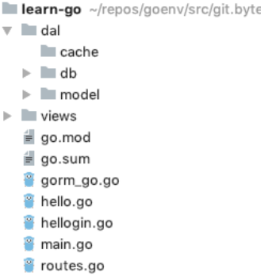

## MOSAD_HW7

### 介绍

个人作业7 - 基于Go语言的服务端接口开发

###  开发环境

* 操作系统：Mac OS / Windows / Linux
* 开发语言：Golang 1.13.1以上版本
* 开发框架：Gin
* 编程环境：Goland / Visual Studio / Vim 等

DeadLine: 12月23日23:59 

### 第15-16周任务

###  基于Go语言的服务端接口开发

### 实验目的

1. 学习使用Go语言进行服务端接口开发
2. 学习使用Gin、Gorm等组件，完成业务接口开发需求
3. 完成客户端交互与服务端接口的数据对接

### 实验内容

首先，根据课堂教学PPT的内容，完成服务端开发环境搭建。
其次，根据课堂教学PPT的内容，完成服务端项目仓库的初始化，目录参考结构如下：

然后使用Go语言完成服务端接口开发，具体业务需求如下：

初始页面是应用启动后显示的第一个页面，可以上下滑动查看feed流。

1. 设计服务端接口协议，完善信息流接口
  - 参考课堂提到的样例代码，独立完成feed流内容接口的定义和开发
2. 设计服务端接口协议及数据库表设计，支持用户注册登录功能
  - 完善App页面右下角的“个人中心”，支持输入用户名+密码完成注册、登录的功能
  - 支持用户退出登录
3. 设计服务端接口协议及数据库表设计，支持点赞功能
  - 每个feed流中的文章，会显示该文章累计获得的点赞总数
  - 用户登录状态下， 每个文章会显示用户是否已经点赞过，如果点赞过，则会显示为红色实心的“心”，没有点赞过，则显示空心的“心”。
  - 用户可以对文章进行点赞和取消点赞操作。如果用户未登录，则服务端接口返回未登录，客户端页面跳转用户登录注册界面。如果用户已登录，则可以进行点赞和取消点赞。
  - 一个登录用户最多只能点赞同一文章一次，对已点赞的文章再次点赞，则相当于进行取消点赞操作。

### 验收内容

- 服务端接口定义文件完整，接口明确清晰，设计合理。请使用markdown语法编写，明确定义接口定义文件。在每个接口定义中，都需要包含以下内容：
  - 接口URL
  - 请求方式
  - 请求参数
  - 返回字段
  - 请求样例
- 用Go语言完成每个接口的服务端代码实现。
- 如涉及到数据库表设计，需提交数据库表建表的SQL语句。

### 加分项1
1. 与客户端讲座课的App结合，完成相应的界面交互设计，支持在App中调用服务端接口。
2. 服务端接口及App界面的正常逻辑分支和异常逻辑分支能够处理完善。

### 加分项2

#### 实验内容
1. 支持评论及评论回复功能。具体业务需求如下：
  - 每个feed流中的文章，显示文章评论数。
  - 点击评论icon，可以进入评论列表页。
  - 评论列表页可以分页加载评论数据，每页显示10条，通过上滑可以加载更多评论数据。
  - 用户可以发表新评论。
  - 用户可以回复已有评论，回复评论需要关联到父评论上。
  - 用户可以回复一条评论的回复，即实现“盖楼”功能。

#### 验收内容
- 服务端接口定义文件完整，接口明确清晰，设计合理。请使用markdown语法编写，明确定义接口定义文件。在每个接口定义中，都需要包含以下内容：
  - 接口URL
  - 请求方式
  - 请求参数
  - 返回字段
  - 请求样例
- 用Go语言完成每个接口的服务端代码实现。
- 如涉及到数据库表设计，需提交数据库表建表的SQL语句。
- 完成App中评论页面的交互设计，实现评论列表页功能。
  - 在评论列表页中，支持上滑加载更多评论。
  - 评论的回复可以合理地显示在界面中（可以参考网易新闻的盖楼功能）。
 
  

### 提交要求及命名格式

/src 存放项目文件

/report 存放项目报告

个人项目提交方式:

- 布置的个人项目先fork到个人仓库下；
- clone自己仓库的个人项目到本地目录；
- 在个人项目中，在src、report目录下，新建个人目录，目录名为“学号+姓名”，例如“12345678WangXiaoMing”；
在“src\12345678WangXiaoMing”目录下，保存项目，按要求完成作业;
- 实验报告以md的格式，写在“report\12345678WangXiaoMing”目录下；
- 完成任务需求后，Pull Request回主项目的master分支，PR标题为“学号+姓名”， 如“12345678王小明”；
- 一定要在deadline前PR。因为批改后，PR将合并到主项目，所有同学都能看到合并的结果，所以此时是不允许再PR提交作业的。
