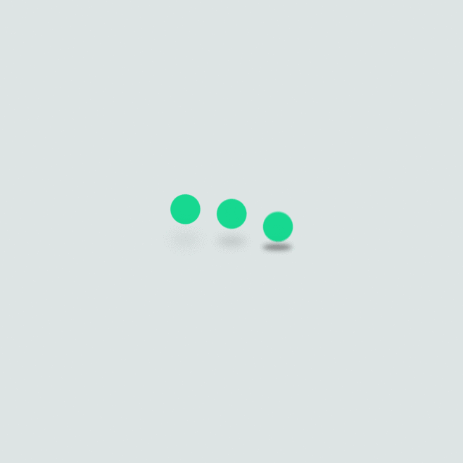
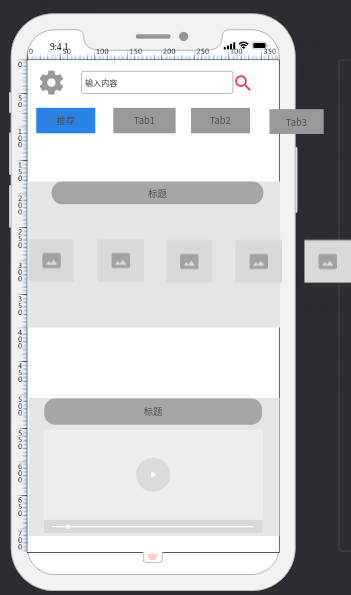

# 应用启动加载页

可以设置 *图片(灰度->彩色)/动画* 来提示是否已经完成初始化(连接服务器，预加载本地图片等)

加载图本地保存，例如:

完成后跳转应用首页

# 应用首页

初定用以展示新闻

暂时设计:

## 功能

+ 搜索框每次输入新字符都会向后端发起请求，并实时显示结果条目。结果条目包括**新闻**,**视频**,**图片**类型。
+ 需请求并保存额外的预览图，可以左右滑动浏览更多
+ 支持设置不感兴趣(做一下关键字过滤，后端的日志应该可以看出效果)，方案可以用
  + 长按条目
  + 在预览图下方左滑，新闻右边滑出红色的不感兴趣按钮(可能和切换Tab冲突)
  + (optional) 长按条目使其悬浮，跟随触摸位置，扔到垃圾箱或者收藏夹里面，有点magic，不确定能不能做，要做的话组件架构可能要改。
  + (optional) 上一步简化一点: 长按条目使其颜色淡化，但不跟随触摸位置，手指拖到垃圾箱图标或收藏夹图标时，图标放大，提示用户可以放手。功能和上一条一样，感觉好做一些。

## 流程

+ 组件挂载后向服务端请求

  + 各Tab的标签名
  + 当前Tab一定数量条目(比如一次请求8条新闻)的新闻信息

# 图片页